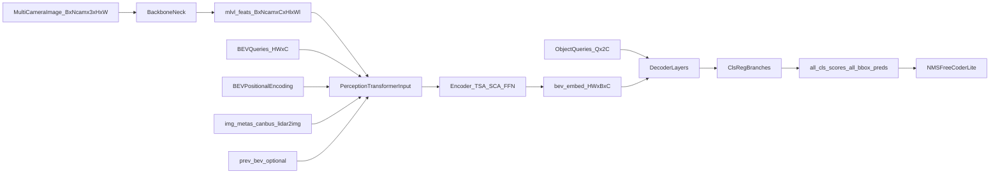

# BEVFormer Paper-to-Code Study Guide

This note explains BEVFormer by binding paper concepts to your pure-PyTorch implementation.

Primary references:
- Paper: `BEVFormer.pdf`
- Implementation: `pure_torch_bevformer/`
- Shape verification: `tests/bevformer.py`

## 1) Canonical study setup (fixed dummy run)

Use one setup for all sections so tensor flow stays stable.

- Config:
  - `debug_forward_config("tiny", bev_hw=(12, 12), num_queries=48, encoder_layers=2, decoder_layers=2)`
- Input image:
  - `img`: `[B, Ncam, C, H, W] = [1, 6, 3, 96, 160]`
- Metadata:
  - `img_metas`: one sample with:
    - `can_bus`: 18-D
    - `lidar2img`: `6 x (4x4)`
    - `img_shape`: per-camera `(H, W, 3)`

Core dimensions under this setup:
- `embed_dims = 256`
- `num_classes = 10`
- `num_encoder_layers = 2`
- `num_decoder_layers = 2`
- `num_queries = 48`
- `bev_h = bev_w = 12` so `HW = 144`

Expected outputs:
- `bev_embed`: `[HW, B, C] = [144, 1, 256]`
- `all_cls_scores`: `[num_dec, B, Q, num_classes] = [2, 1, 48, 10]`
- `all_bbox_preds`: `[num_dec, B, Q, 10] = [2, 1, 48, 10]`

These shapes are validated in:
- `tests/bevformer.py`

## 2) Symbol dictionary (paper -> code tensors)

- `Q` (BEV queries in paper) -> `self.bev_embedding.weight` in `BEVFormerHeadLite`
  - shape: `[HW, C]`
- `B_t` (current BEV feature) -> `bev_embed`
  - shape in model outputs: `[HW, B, C]`
- `B_{t-1}` (previous BEV) -> `prev_bev` argument
  - encoder internal shape (batch-first): `[B, HW, C]`
- `F_t^i` (image feature for camera `i`) -> per-level `mlvl_feats[level][:, i]`
  - level tensor shape: `[B, Ncam, C, H_l, W_l]`
- 3D reference points from pillars -> `ref_3d`
  - shape: `[B, D, HW, 3]`, here `D = num_points_in_pillar = 4`
- 2D temporal reference points -> `ref_2d`
  - shape: `[B, HW, 1, 2]`
- projected camera ref points -> `reference_points_cam`
  - shape: `[Ncam, B, HW, D, 2]`
- hit mask per camera -> `bev_mask`
  - shape: `[Ncam, B, HW, D]`

Equation ID convention used below: `E<chunk>.<index>`.

---

## Chunk 0 - Orientation and notation

### Goal
Create a map from paper notation and equations to concrete tensors in your implementation.

### Paper concept/equation
- BEV queries form a grid over ground plane.
- Encoder layer structure: temporal self-attention -> spatial cross-attention -> FFN.

### Explicit equations
`(E0.1)` End-to-end feature generation and prediction:

$$
B_t = \mathrm{Encoder}(Q_t, F_t, B_{t-1}), \quad \hat{Y}_t = \mathrm{Head}(B_t)
$$

`(E0.2)` Query and image-feature set definition:

$$
Q_t \in \mathbb{R}^{(H \cdot W)\times C}, \quad F_t=\{F_t^i\}_{i=1}^{N_{cam}}
$$

### Symbol table (E0.*)
- `B_t`: current BEV memory (`bev_embed`)
- `Q_t`: BEV query tensor for frame `t` (`bev_queries`)
- `F_t`: multi-camera feature set (`mlvl_feats`)
- `B_{t-1}`: previous BEV memory (`prev_bev`)
- `\hat{Y}_t`: final head outputs (`all_cls_scores`, `all_bbox_preds`)

### Code mapping
- `BEVFormerLite.forward` in `pure_torch_bevformer/model.py`
- `BEVFormerHeadLite.forward` in `pure_torch_bevformer/head.py`
- `BEVFormerEncoderLite` and `BEVFormerLayerLite` in `pure_torch_bevformer/modules/encoder.py`

### Key code snippet
```python
img_feats = self.extract_img_feat(img)
outputs = self.head(img_feats, img_metas, prev_bev=prev_bev, only_bev=only_bev)
```

### Input tensors (shape + meaning)
- `img`: `[1, 6, 3, 96, 160]`, multi-camera RGB.
- `img_metas`: geometric and ego-motion metadata.

### Output tensors (shape + meaning)
- Full dict including `bev_embed`, class logits, box predictions.

### Math intuition (plain language)
Treat each BEV grid cell as a "question token": "What exists at this ground location?".
The model answers by looking across cameras (spatial) and previous BEV state (temporal).

### One sanity check
If you remove temporal input (`prev_bev=None`), model still runs. Temporal branch degenerates to self-only behavior.

---

## Chunk 1 - Image features (backbone + neck)

### Goal
Understand how multi-camera images become camera feature maps for the transformer.

### Paper concept/equation
This is pre-transformer image encoding (`F_t^i` per camera).

### Explicit equations
`(E1.1)` Conv output spatial size:

$$
H_{out} = \left\lfloor \frac{H + 2p - k}{s} \right\rfloor + 1,\quad
W_{out} = \left\lfloor \frac{W + 2p - k}{s} \right\rfloor + 1
$$

`(E1.2)` Camera-batch flatten and reshape:

$$
\mathrm{img\_flat} \in \mathbb{R}^{(B\cdot N_{cam})\times 3\times H\times W}
\rightarrow
F_t^i \in \mathbb{R}^{B\times N_{cam}\times C\times H_l\times W_l}
$$

### Symbol table (E1.*)
- `H, W`: input image height/width
- `k, s, p`: kernel size, stride, padding
- `B`: batch size
- `N_{cam}`: number of cameras
- `H_l, W_l`: feature-map spatial size at level `l`
- `C`: feature channels

### Code mapping
- `extract_img_feat` in `pure_torch_bevformer/model.py`
- `BackboneNeck` in `pure_torch_bevformer/backbone_neck.py`

### Key code snippet
```python
img_flat = img.reshape(batch_size * num_cams, channels, height, width)
img_feats = self.backbone_neck(img_flat)
for feat in img_feats:
    reshaped.append(feat.view(batch_size, num_cams, feat_channels, feat_h, feat_w))
```

### Input tensors (shape + meaning)
- Input `img`: `[B, Ncam, 3, H, W] = [1, 6, 3, 96, 160]`
- Flatten for CNN: `[B*Ncam, 3, H, W] = [6, 3, 96, 160]`

### Output tensors (shape + meaning)
- Backbone stage outputs before FPN:
  - stem: `[6, 64, 48, 80]`
  - stage0: `[6, 64, 48, 80]`
  - stage1: `[6, 128, 24, 40]`
  - stage2: `[6, 256, 12, 20]`
  - stage3: `[6, 512, 6, 10]`
- FPN selected output (`tiny` debug uses one level):
  - `[6, 256, 6, 10]`
- Reshaped multi-camera level tensor:
  - `[B, Ncam, C, H_l, W_l] = [1, 6, 256, 6, 10]`

### Math intuition (plain language)
Each camera image is encoded independently by shared CNN weights, then packed back into camera dimension for cross-view reasoning.

### One sanity check
Test hook `fpn.output0` must be `[batch_size * cams, 256, 6, 10]`.

---

## Chunk 2 - BEV query initialization

### Goal
Understand what is fed into the BEV transformer before attention starts.

### Paper concept/equation
- Learnable BEV query grid `Q in R^(H x W x C)` (paper Sec. 3.2).
- Positional embedding added to encode BEV coordinates.

### Explicit equations
`(E2.1)` BEV query initialization in code:

$$
Q_0 = E_{bev} + PE_{bev} + \mathbf{1}_{use\_can\_bus}\cdot \mathrm{MLP}(can\_bus)
$$

`(E2.2)` Tensor shapes:

$$
E_{bev}\in\mathbb{R}^{HW\times C},\quad PE_{bev}\in\mathbb{R}^{HW\times B\times C}
$$

### Symbol table (E2.*)
- `Q_0`: initialized BEV query tensor entering encoder
- `E_{bev}`: learnable BEV embedding (`self.bev_embedding.weight`)
- `PE_{bev}`: learned 2D positional encoding (`bev_pos`)
- `\mathbf{1}_{use_can_bus}`: gate indicating whether CAN bus injection is enabled
- `MLP(can_bus)`: motion/context embedding from CAN bus vector
- `HW`: number of BEV cells (`bev_h * bev_w`)

### Code mapping
- `BEVFormerHeadLite.forward` in `pure_torch_bevformer/head.py`
- `LearnedPositionalEncoding2D` in `pure_torch_bevformer/utils/positional_encoding.py`
- `PerceptionTransformerLite.get_bev_features` in `pure_torch_bevformer/modules/transformer.py`

### Key code snippet
```python
bev_queries = self.bev_embedding.weight.to(dtype)
bev_pos = self.positional_encoding(bev_mask).to(dtype)
can_bus = self.can_bus_mlp(can_bus)[None, :, :]
bev_queries = bev_queries.unsqueeze(1).repeat(1, bs, 1)
if self.use_can_bus:
    bev_queries = bev_queries + can_bus
```

### Input tensors (shape + meaning)
- `bev_embedding.weight`: `[HW, C] = [144, 256]`
- `query_embedding.weight`: `[Q, 2C] = [48, 512]` (split later into `query_pos`, `query`)
- `bev_mask`: `[B, H, W] = [1, 12, 12]` (used only to build positional embeddings)
- `can_bus`: `[B, 18]`

### Output tensors (shape + meaning)
- `bev_queries` expanded to transformer shape: `[HW, B, C] = [144, 1, 256]`
- `bev_pos` flattened/permuted: `[HW, B, C] = [144, 1, 256]`
- can-bus embedding: `[1, B, C] = [1, 1, 256]`, added to BEV queries when enabled

### Math intuition (plain language)
BEV queries are learnable latent slots at fixed ground coordinates; positional encoding tells each slot where it is; CAN bus injects ego-motion context.

### One sanity check
`head.positional_encoding` hook should be `[B, C, bev_h, bev_w] = [1, 256, 12, 12]`.

---

## Chunk 3 - Geometry and projection bridge (Eq. 3-4)

### Goal
Connect BEV grid cells to image-plane sampling locations.

### Paper concept/equation
- Eq. (3): map BEV grid `(x, y)` to world `(x', y')`.
- Eq. (4): project `(x', y', z'_j)` to each camera view.

### Explicit equations
`(E3.1)` BEV grid to world coordinates (paper Eq. 3):

$$
x' = (x - \tfrac{W}{2})\cdot s,\quad y' = (y - \tfrac{H}{2})\cdot s
$$

`(E3.2)` Projection to camera image (paper Eq. 4):

$$
z_{ij}\,[u_{ij}, v_{ij}, 1]^T = T_i [x', y', z'_j, 1]^T
$$

`(E3.3)` Code-side image normalization:

$$
u^{norm} = \frac{u}{W_{img}},\quad v^{norm} = \frac{v}{H_{img}}
$$

`(E3.4)` Validity mask in code:

$$
mask = (z>\epsilon)\wedge(0<u^{norm}<1)\wedge(0<v^{norm}<1)
$$

### Symbol table (E3.*)
- `x, y`: BEV cell index coordinates
- `x', y'`: world-plane coordinates in meters
- `W, H`: BEV grid width/height
- `s`: BEV resolution (meters per cell)
- `z'_j`: pillar anchor height for anchor `j`
- `T_i`: projection matrix for camera `i`
- `u, v`: projected image coordinates
- `W_{img}, H_{img}`: image width/height for normalization
- `\epsilon`: small positive threshold for depth validity
- `mask`: whether projected points are valid and in-frame

### Code mapping
- `get_reference_points_3d`, `get_reference_points_2d`, `point_sampling`
  in `pure_torch_bevformer/utils/geometry.py`
- Called in encoder forward:
  `pure_torch_bevformer/modules/encoder.py`

### Key code snippet
```python
reference_points[..., 0:1] = reference_points[..., 0:1] * (pc_range[3] - pc_range[0]) + pc_range[0]
reference_points[..., 1:2] = reference_points[..., 1:2] * (pc_range[4] - pc_range[1]) + pc_range[1]
reference_points[..., 2:3] = reference_points[..., 2:3] * (pc_range[5] - pc_range[2]) + pc_range[2]
reference_points_cam = torch.matmul(lidar2img.float(), reference_points.float()).squeeze(-1)
reference_points_cam = reference_points_cam[..., 0:2] / torch.maximum(
    reference_points_cam[..., 2:3], torch.ones_like(reference_points_cam[..., 2:3]) * eps
)
```

### Input tensors (shape + meaning)
- BEV geometry: `bev_h=12`, `bev_w=12`, `pc_range`
- `num_points_in_pillar=4` (vertical anchors in each BEV cell)
- Camera projection matrices from `img_metas[i]["lidar2img"]`

### Output tensors (shape + meaning)
- `ref_3d`: `[B, D, HW, 3] = [1, 4, 144, 3]` (normalized before projection)
- `ref_2d`: `[B, HW, 1, 2] = [1, 144, 1, 2]`
- `reference_points_cam`: `[Ncam, B, HW, D, 2] = [6, 1, 144, 4, 2]`
- `bev_mask`: `[Ncam, B, HW, D] = [6, 1, 144, 4]` (which camera-depth anchors are visible)

### Math intuition (plain language)
For each BEV cell, create a vertical pillar with multiple height anchors, project anchors to every camera, and keep only valid in-image projections.

### One sanity check
If projection puts all points out-of-frame, `max_len == 0` path in spatial cross-attention returns residual-only output.

---

## Chunk 4 - Temporal self-attention (TSA)

### Goal
Understand how current BEV state is fused with previous BEV memory.

### Paper concept/equation
- Paper Eq. (5): `TSA(Q_p, {Q, B'_{t-1}})` using deformable attention over current + previous BEV.
- First frame degenerates to `{Q, Q}`.

### Explicit equations
`(E4.1)` Temporal self-attention (paper Eq. 5 style):

$$
\mathrm{TSA}(Q_p,\{Q,B'_{t-1}\}) = \sum_{V\in\{Q,B'_{t-1}\}} \mathrm{DeformAttn}(Q_p, p, V)
$$

`(E4.2)` Sampling location for normalized 2D reference points:

$$
\mathrm{sampling\_locations} = r + \frac{\Delta p}{[W_l, H_l]}
$$

where `r` is `reference_points` and `\Delta p` are learned offsets.

### Symbol table (E4.*)
- `Q_p`: BEV query at location `p`
- `B'_{t-1}`: ego-aligned previous BEV memory
- `V`: one source in `{Q, B'_{t-1}}`
- `r`: normalized reference points used by deformable sampling
- `\Delta p`: learned offsets from attention module
- `W_l, H_l`: feature-map width/height for normalization

### Code mapping
- `TemporalSelfAttentionLite` in
  `pure_torch_bevformer/modules/temporal_self_attention.py`
- `hybrid_ref_2d` and `prev_bev` construction in
  `pure_torch_bevformer/modules/encoder.py`
- Shift computation from CAN bus in
  `pure_torch_bevformer/modules/transformer.py`

### Key code snippet
```python
if value is None:
    value = torch.stack([query, query], dim=1).reshape(bs * 2, len_bev, channels)
query = torch.cat([value[:bs], query], dim=-1)
sampling_offsets = self.sampling_offsets(query).view(...)
attention_weights = self.attention_weights(query).view(...).softmax(dim=-1)
output = ms_deform_attn_torch(value, spatial_shapes, sampling_locations, attention_weights)
```

### Input tensors (shape + meaning)
- `query` from encoder: `[B, HW, C] = [1, 144, 256]`
- `prev_bev`:
  - if absent: module duplicates current query internally (`[2, HW, C]`)
  - if present: stacked with current query in encoder as two-frame queue
- `reference_points` for TSA: `hybrid_ref_2d` shape `[2B, HW, 1, 2] = [2, 144, 1, 2]`
- `spatial_shapes` for BEV queue view: `[[bev_h, bev_w]] = [[12, 12]]`

### Output tensors (shape + meaning)
- TSA output: `[B, HW, C] = [1, 144, 256]`

### Math intuition (plain language)
Instead of hard correspondence between frames, model learns offsets/weights to fetch temporal context from previous and current BEV queues around each BEV location.

### One sanity check
When `prev_bev is None`, behavior matches paper note: temporal branch falls back to self-attention-like behavior with duplicated current BEV.

---

## Chunk 5 - Spatial cross-attention (SCA)

### Goal
Understand how each BEV query gathers evidence from multiple cameras efficiently.

### Paper concept/equation
- Paper Eq. (2): average over hit views, each with deformable sampling around projected reference points.

### Explicit equations
`(E5.1)` Spatial cross-attention aggregation (paper Eq. 2):

$$
\mathrm{SCA}(Q_p, F_t) = \frac{1}{|V_{hit}|}\sum_{i\in V_{hit}} \sum_{j=1}^{N_{ref}}
\mathrm{DeformAttn}(Q_p, P(p,i,j), F_t^i)
$$

`(E5.2)` Deformable attention kernel form:

$$
\mathrm{DeformAttn}(q,p,x)=\sum_{h=1}^{N_h}\sum_{k=1}^{N_k} A_{h,k}\,x(p+\Delta p_{h,k})
$$

### Symbol table (E5.*)
- `V_{hit}`: cameras where projected anchors are valid
- `N_{ref}`: number of 3D reference anchors per BEV cell
- `P(p,i,j)`: projected 2D point for BEV cell `p`, camera `i`, anchor `j`
- `F_t^i`: feature map of camera `i`
- `N_h`: number of attention heads
- `N_k`: number of sampled points per head
- `A_{h,k}`: normalized attention weight
- `\Delta p_{h,k}`: learned offset of sampled key

### Code mapping
- `SpatialCrossAttentionLite` in
  `pure_torch_bevformer/modules/spatial_cross_attention.py`
- `MSDeformableAttention3DLite` and `ms_deform_attn_torch` in
  `pure_torch_bevformer/modules/deformable_attention.py`

### Key code snippet
```python
queries = self.deformable_attention(
    query=queries_rebatch.view(bs * self.num_cams, max_len, self.embed_dims),
    value=value,
    reference_points=reference_points_rebatch.view(bs * self.num_cams, max_len, num_depth, 2),
    spatial_shapes=spatial_shapes,
    level_start_index=level_start_index,
).view(bs, self.num_cams, max_len, self.embed_dims)
slots = slots / count[..., None]
```

### Input tensors (shape + meaning)
- `query`: `[B, HW, C] = [1, 144, 256]`
- `key`, `value`: `[Ncam, S, B, C] = [6, 60, 1, 256]`
  - `S = H_l * W_l = 6 * 10 = 60`
- `reference_points_cam`: `[6, 1, 144, 4, 2]`
- `bev_mask`: `[6, 1, 144, 4]`
- `spatial_shapes`: `[[6, 10]]`

### Output tensors (shape + meaning)
- SCA output: `[B, HW, C] = [1, 144, 256]`
- Internally:
  - valid-query rebatch: `queries_rebatch [B, Ncam, max_len, C]`
  - deformable output merged back into `slots [B, HW, C]`
  - final normalization by number of hit cameras (`count`)

### Math intuition (plain language)
Each BEV cell does not attend everywhere in every image. It only samples a few points near projected anchors in cameras that can see that cell, then averages across visible cameras.

### One sanity check
`count = clamp(hit_camera_count, min=1)` prevents divide-by-zero when no camera hits.

---

## Chunk 6 - Encoder recurrence result

### Goal
Understand what one encoder layer does and what the stacked encoder outputs.

### Paper concept/equation
Per encoder layer:
- temporal aggregation -> spatial aggregation -> FFN refinement.

### Explicit equations
Let `l` be encoder layer index:
`(E6.1)` Temporal update:

$$
\tilde{B}^{(l)} = \mathrm{LN}(\mathrm{TSA}(B^{(l)}))
$$

`(E6.2)` Spatial update:

$$
\hat{B}^{(l)} = \mathrm{LN}(\mathrm{SCA}(\tilde{B}^{(l)}, F_t))
$$

`(E6.3)` FFN refinement:

$$
B^{(l+1)} = \mathrm{LN}(\mathrm{FFN}(\hat{B}^{(l)}))
$$

### Symbol table (E6.*)
- `l`: encoder layer index
- `B^{(l)}`: BEV features entering layer `l`
- `\tilde{B}^{(l)}`: post-temporal features
- `\hat{B}^{(l)}`: post-spatial features
- `B^{(l+1)}`: output BEV features after FFN and normalization
- `LN`: layer normalization

### Code mapping
- `BEVFormerLayerLite.forward` and `BEVFormerEncoderLite.forward`
  in `pure_torch_bevformer/modules/encoder.py`

### Key code snippet
```python
query = self.temporal_attn(...)
query = self.norms[0](query)
query = self.spatial_attn(...)
query = self.norms[1](query)
query = self.ffn(query)
query = self.norms[2](query)
```

### Input tensors (shape + meaning)
- Initial BEV query (after prep): `[B, HW, C] = [1, 144, 256]`
- Camera features and projected refs from previous chunks.

### Output tensors (shape + meaning)
- After each encoder layer: `[1, 144, 256]`
- Final encoder output (fed to decoder as memory): `[1, 144, 256]`
- Head output form: permuted to `[HW, B, C] = [144, 1, 256]`

### Math intuition (plain language)
The encoder repeatedly refines a world-aligned BEV memory by alternating temporal smoothing and image-grounded updates.

### One sanity check
Intermediate hooks `encoder.layer{i}` all keep identical shape `[B, HW, C]`.

---

## Chunk 7 - Decoder and iterative reference refinement

### Goal
Understand how object queries read BEV memory and progressively update box anchors.

### Paper concept/equation
Detection head follows Deformable DETR-style query decoding with iterative reference refinement.

### Explicit equations
Decoder reference refinement per layer `l`:
`(E7.1)` XY reference update:

$$
r^{(l+1)}_{xy} = \sigma\left(\Delta^{(l)}_{xy} + \sigma^{-1}(r^{(l)}_{xy})\right)
$$

`(E7.2)` Z reference update:

$$
r^{(l+1)}_{z} = \sigma\left(\Delta^{(l)}_{z} + \sigma^{-1}(r^{(l)}_{z})\right)
$$

Head metric-space conversion:
`(E7.3)` Coordinate denormalization to metric space:

$$
x = \hat{x}(x_{max}-x_{min}) + x_{min},\quad
y = \hat{y}(y_{max}-y_{min}) + y_{min},\quad
z = \hat{z}(z_{max}-z_{min}) + z_{min}
$$

### Symbol table (E7.*)
- `r^{(l)}_{xy}, r^{(l)}_z`: reference points before decoder layer `l`
- `\Delta^{(l)}_{xy}, \Delta^{(l)}_z`: decoder-predicted deltas from regression branch
- `\sigma`: sigmoid function
- `\sigma^{-1}`: inverse sigmoid (`inverse_sigmoid`)
- `\hat{x}, \hat{y}, \hat{z}`: normalized box-center coordinates in `[0,1]`
- `x_{min/max}, y_{min/max}, z_{min/max}`: bounds from `pc_range`

### Code mapping
- `PerceptionTransformerLite.forward` in
  `pure_torch_bevformer/modules/transformer.py`
- `DetectionTransformerDecoderLite.forward` in
  `pure_torch_bevformer/modules/decoder.py`
- class/reg branches in `pure_torch_bevformer/head.py`

### Key code snippet
```python
new_reference_points[..., :2] = tmp[..., :2] + inverse_sigmoid(reference_points[..., :2])
new_reference_points[..., 2:3] = tmp[..., 4:5] + inverse_sigmoid(reference_points[..., 2:3])
reference_points = new_reference_points.sigmoid().detach()

tmp[..., 0:2] = (tmp[..., 0:2] + reference[..., 0:2]).sigmoid()
tmp[..., 4:5] = (tmp[..., 4:5] + reference[..., 2:3]).sigmoid()
```

### Input tensors (shape + meaning)
- Object query embedding: `[Q, 2C] = [48, 512]`
  - split to `query_pos [Q, C]` and `query [Q, C]`
- Decoder query (sequence-first): `[Q, B, C] = [48, 1, 256]`
- Decoder memory (`bev_embed`): `[HW, B, C] = [144, 1, 256]`
- Initial reference points from linear layer + sigmoid: `[B, Q, 3] = [1, 48, 3]`

### Output tensors (shape + meaning)
- `inter_states`: `[num_dec, Q, B, C] = [2, 48, 1, 256]`
- `inter_references`: `[num_dec, B, Q, 3] = [2, 1, 48, 3]`
- Head-level logits and box predictions:
  - per layer class: `[B, Q, num_classes] = [1, 48, 10]`
  - per layer box code: `[B, Q, 10] = [1, 48, 10]`

### Math intuition (plain language)
Each object query starts with a coarse 3D reference point and iteratively shifts/refines it after each decoder layer.

### One sanity check
Decoder hook shapes remain `[Q, B, C]`; head branch hooks remain `[B, Q, ...]` after permutation in `head.py`.

---

## Chunk 8 - Box parameterization and decode

### Goal
Understand predicted box code semantics and final filtering.

### Paper concept/equation
3D boxes are predicted from decoder outputs; center dimensions and rotation are encoded in a DETR-like regression code.

### Explicit equations
From code representation to metric box:
`(E8.1)` Rotation and size decode:

$$
\theta = \operatorname{atan2}(\sin\theta, \cos\theta),\quad
w = e^{\hat{w}},\ l = e^{\hat{l}},\ h = e^{\hat{h}}
$$

Top-k class selection:
`(E8.2)` Class-score flatten + top-k:

$$
scores, idx = \mathrm{topk}(\sigma(cls), K),\quad label = idx \bmod N_{class}
$$

### Symbol table (E8.*)
- `\hat{w}, \hat{l}, \hat{h}`: log-size predictions
- `w, l, h`: decoded metric box dimensions
- `\theta`: decoded yaw angle
- `cls`: classification logits tensor
- `K`: `max_num` top predictions retained
- `idx`: flattened class-query index
- `N_{class}`: number of classes
- `label`: class ID after modulo operation

### Code mapping
- Regression adjustment in `pure_torch_bevformer/head.py`
  - uses `inverse_sigmoid` from `pure_torch_bevformer/utils/math.py`
- Box decode utilities in `pure_torch_bevformer/utils/boxes.py`
- Top-k and range filtering in `pure_torch_bevformer/postprocess/nms_free_coder.py`

### Key code snippet
```python
scores, indices = cls_scores.view(-1).topk(self.max_num)
labels = indices % self.num_classes
bbox_indices = indices // self.num_classes
rot = torch.atan2(normalized_bboxes[..., 6:7], normalized_bboxes[..., 7:8])
w = normalized_bboxes[..., 2:3].exp()
```

### Input tensors (shape + meaning)
- `all_cls_scores[-1]`: `[B, Q, 10]`
- `all_bbox_preds[-1]`: `[B, Q, 10]`

### Output tensors (shape + meaning)
- Decoded per-sample dict:
  - `bboxes`: `[N, 9]` (`cx, cy, cz, w, l, h, rot, vx, vy`)
  - `scores`: `[N]`
  - `labels`: `[N]`
- `N <= max_num = 300`

### Math intuition (plain language)
Class logits are sigmoid-scored, top-k candidates are selected, and box codes are transformed to metric-space boxes with range and score filtering.

### One sanity check
`get_bboxes` shifts `z` from center to bottom by `z = z - h/2`, matching downstream box convention.

---

## Chunk 9 - End-to-end trace and study drills

### Goal
Provide one full dataflow pass plus quick exercises for retention.

### Paper concept/equation
Whole pipeline: multi-camera features + temporal memory -> BEV memory -> object queries -> 3D boxes.

### Explicit equations
Compact full pipeline:
`(E9.1)` Full forward map:

$$
\hat{Y}_t = \mathrm{Decode}\Big(\mathrm{Head}\big(\mathrm{Encoder}(Q_t, F_t, B_{t-1})\big)\Big)
$$

where `Decode` is NMS-free top-k + range filtering in this repo.

### Symbol table (E9.*)
- `Q_t`: BEV queries for frame `t`
- `F_t`: multi-camera encoded features
- `B_{t-1}`: previous BEV memory
- `Encoder(...)`: BEVFormer encoder stack
- `Head(...)`: decoder + cls/reg branches
- `Decode(...)`: `NMSFreeCoderLite` postprocess
- `\hat{Y}_t`: final predictions (`bboxes`, `scores`, `labels`)

### Code mapping
- `BEVFormerLite.forward` in `pure_torch_bevformer/model.py`

### Key code snippet
```python
outputs = model(img, img_metas, decode=True)
preds = outputs["preds"]
decoded = outputs["decoded"]
```

### Input tensors (shape + meaning)
- `img [1,6,3,96,160]`, `img_metas` (including projection and can-bus)

### Output tensors (shape + meaning)
- `bev_embed [144,1,256]`
- `all_cls_scores [2,1,48,10]`
- `all_bbox_preds [2,1,48,10]`
- decoded predictions list per sample

### Math intuition (plain language)
BEVFormer is an information routing system: BEV grid queries route attention to relevant spatiotemporal evidence, then object queries read the BEV world model for detection.

### One sanity check
All major intermediate hooks in `tests/bevformer.py` should be present and finite.

---

## 3) Dataflow diagram



## 4) One end-to-end tensor trace

1. Start with `img [1,6,3,96,160]`.
2. Backbone+FPN returns one level `[1,6,256,6,10]`.
3. Build BEV queries and positions:
   - `bev_queries [144,1,256]`
   - `bev_pos [144,1,256]`
4. Flatten camera features for encoder:
   - `feat_flatten [6,60,1,256]`, `spatial_shapes [[6,10]]`.
5. Geometry/projection:
   - `ref_3d [1,4,144,3]`, `ref_2d [1,144,1,2]`
   - `reference_points_cam [6,1,144,4,2]`, `bev_mask [6,1,144,4]`
6. Run 2 encoder layers:
   - each layer output `[1,144,256]`
   - final BEV memory -> `[144,1,256]`.
7. Initialize 48 object queries:
   - `query/query_pos [48,1,256]`
   - `init_reference [1,48,3]`.
8. Run 2 decoder layers:
   - hidden states `[2,48,1,256]`
   - references `[2,1,48,3]`.
9. Detection branches produce:
   - `all_cls_scores [2,1,48,10]`
   - `all_bbox_preds [2,1,48,10]`.
10. NMS-free decode selects top-k candidates and outputs final boxes/scores/labels.

## 5) Study drills (self-check questions)

1. Why does BEVFormer use BEV grid queries instead of directly decoding objects from image features?
2. In your code, what concrete tensors correspond to paper symbols `Q`, `B_t`, and `F_t^i`?
3. How does `point_sampling` decide whether a camera is a hit view for a BEV query?
4. Why does spatial cross-attention average over hit cameras (`slots / count`)?
5. What changes in temporal self-attention when `prev_bev` is `None`?
6. Where exactly are offsets and attention weights predicted in deformable attention?
7. Why are decoder reference points passed through `inverse_sigmoid` before refinement?
8. Which box coordinates are normalized and then rescaled to `pc_range` in `head.py`?
9. What is the conceptual difference between encoder BEV queries and decoder object queries?
10. Why can the model be considered "RNN-like" across frames even though it is transformer-based?
11. If `bev_mask` is mostly false, what behavior do you expect from SCA outputs?
12. Which intermediate tensor hooks would you inspect first to debug geometry mismatch?

## 6) Practical reading order for this note

1. Read Sections 1 and 2 once.
2. Walk through Chunks 1 -> 6 first (build BEV memory).
3. Then study Chunks 7 and 8 (decode objects).
4. Re-run the end-to-end trace in Section 4 while stepping through code.
5. Answer study drills without looking at code, then verify.

## 7) Known implementation simplifications in this repo

- `rotate_prev_bev` is currently a no-op in `PerceptionTransformerLite.get_bev_features`.
- This implementation focuses on clear forward-path mechanics and shape transparency, not kernel-level optimization.
- Deformable attention uses pure PyTorch `grid_sample` instead of custom CUDA ops.

These simplifications are useful for study because they keep BEVFormer concepts explicit.
