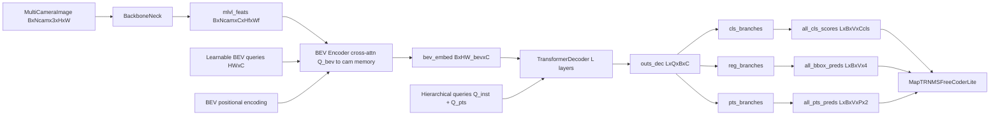

# MapTR Paper-to-Code Study Guide

This note maps MapTR paper symbols and concepts to the pure-PyTorch forward implementation in this repository.

Primary references:
- Paper: `papers/MapTR.pdf`
- Reference code: `repos/MapTR/`
- Implementation: `pytorch_implementation/perception/maptr/`
- Intermediate tensor tests: `tests/perception/maptr.py`

## 1) Canonical study setup (fixed debug run)

Use one setup so equation-to-tensor mapping remains stable across sections.

- Config:
  - `debug_forward_config(num_vec=10, num_pts_per_vec=4, decoder_layers=2)`
- Input image:
  - `img`: `[B, Ncam, C, H, W] = [1, 6, 3, 96, 160]`
- Metadata (`img_metas`):
  - `img_shape`: per-camera `(96, 160, 3)`
  - `pad_shape`: per-camera `(96, 160, 3)`

Core dimensions under this setup:
- `embed_dims = 128`
- `num_map_classes = 3`
- `num_decoder_layers = 2`
- `num_vec = 10`
- `num_pts_per_vec = 4`
- `num_query = num_vec * num_pts_per_vec = 40`
- `bev_h = 30`, `bev_w = 30`, `bev_tokens = 900`

Expected model outputs:
- `bev_embed`: `[B, HW_bev, C] = [1, 900, 128]`
- `all_cls_scores`: `[L, B, V, Ccls] = [2, 1, 10, 3]`
- `all_bbox_preds`: `[L, B, V, 4]` (normalized `cx, cy, w, h`)
- `all_pts_preds`: `[L, B, V, P, 2]` (normalized points)

These are verified in `tests/perception/maptr.py`.

## 2) Symbol dictionary (paper -> code tensors)

- `I_t` (multi-view camera input) -> `img`
- `F_t` (camera memory features) -> `mlvl_feats[0]` after `extract_img_feat`
- `Q_inst` (instance-level query embedding) -> `instance_embedding.weight`
- `Q_pts` (point-level query embedding) -> `pts_embedding.weight`
- `Q` (hierarchical query, flattened) -> `(Q_inst + Q_pts).reshape(num_query, C)`
- `B` (BEV token set) -> `bev_embed`
- `H_l` (decoder hidden at layer `l`) -> `outs_dec[l]` (before reshape: `[Q, B, C]`)
- `S_l` (vector class logits) -> `all_cls_scores[l]`
- `P_l` (predicted point sets) -> `all_pts_preds[l]`
- `\hat{b}_l` (box from points) -> `all_bbox_preds[l]`

Equation IDs below are stable and use `E<section>.<index>`.

---

## Chunk 0 - End-to-end forward contract

### Goal
Tie the MapTR high-level architecture to concrete module calls.

### Paper concept/equation
MapTR maps multi-view images to vectorized map elements using a BEV-centered transformer and hierarchical queries.

### Explicit equations
`(E0.1)` Feature extraction and structured decoding:

$$
F_t = \mathrm{ImageEncoder}(I_t),\quad
B = \mathrm{BEVEncoder}(F_t),\quad
H = \mathrm{Decoder}(Q, B)
$$

`(E0.2)` Layer-wise predictions:

$$
\hat{Y} = \{(S_l, \hat{b}_l, P_l)\}_{l=1}^{L}
$$

### Symbol table (E0.*)
- `I_t`: multi-camera image tensor
- `F_t`: camera feature memory
- `B`: BEV token memory
- `Q`: hierarchical queries (instance + point)
- `\hat{Y}`: class, box, and point predictions across decoder layers

### Code mapping
- `MapTRLite.forward` in `pytorch_implementation/perception/maptr/model.py`
- `MapTRHeadLite.forward` in `pytorch_implementation/perception/maptr/head.py`
- `MapTRPerceptionTransformerLite.forward` in `pytorch_implementation/perception/maptr/transformer.py`

### One sanity check
`tests/perception/maptr.py` asserts all final output shapes in the debug setup.

---

## Chunk 1 - Hierarchical query embeddings (instance + point)

### Goal
Connect the paper's hierarchical query design to implementation tensors.

### Paper concept/equation
MapTR uses structured query embeddings to jointly model instance-level and point-level information.

### Explicit equations
`(E1.1)` Query composition:

$$
Q_{i,j} = Q^{inst}_i + Q^{pts}_j
$$

`(E1.2)` Flatten query set:

$$
Q = \mathrm{reshape}(Q_{i,j}) \in \mathbb{R}^{(N_{vec}\cdot N_{pts})\times C}
$$

### Symbol table (E1.*)
- `Q^{inst}_i`: embedding for map instance `i`
- `Q^{pts}_j`: embedding for point slot `j` within an instance
- `N_vec`: number of map vectors
- `N_pts`: number of points per vector

### Code mapping
- `instance_embedding`, `pts_embedding` and `_build_query_embedding` in `pytorch_implementation/perception/maptr/head.py`

### Tensor shape notes
- `instance_embedding.weight`: `[N_vec, C]`
- `pts_embedding.weight`: `[N_pts, C]`
- `query_embed`: `[N_vec * N_pts, C]`

### One sanity check
The test file checks hook captures for both embedding modules and decoder token sizes.

---

## Chunk 2 - BEV token construction from camera memory

### Goal
Map BEV encoder behavior to concrete camera/BEV tensors.

### Paper concept/equation
MapTR builds BEV-centric memory by attending BEV queries to multi-view image features.

### Explicit equations
`(E2.1)` Camera token memory:

$$
M = \mathrm{flatten}(F_t) \in \mathbb{R}^{(N_{cam}H_fW_f)\times B\times C}
$$

`(E2.2)` BEV update:

$$
B = \mathrm{FFN}(\mathrm{CrossAttn}(Q_{bev}, M))
$$

### Symbol table (E2.*)
- `M`: flattened camera feature tokens
- `Q_bev`: BEV query tokens
- `B`: BEV memory tokens after cross-attention and FFN

### Code mapping
- `MapTRBEVEncoderLite` in `pytorch_implementation/perception/maptr/transformer.py`
- BEV query table in `MapTRHeadLite.bev_embedding`

### Tensor shape notes
- `bev_embedding.weight`: `[H_bev * W_bev, C]`
- BEV encoder cross-attention output: `[H_bev * W_bev, B, C]`
- `bev_embed`: `[B, H_bev * W_bev, C]`

### One sanity check
Tests assert `bev_encoder.cross_attn` and `bev_embed` shapes for the debug config.

---

## Chunk 3 - Decoder and vectorized predictions

### Goal
Connect decoder tokens to class scores, points, and derived boxes.

### Paper concept/equation
All point queries are decoded in parallel; per-instance classes are predicted from pooled point features.

### Explicit equations
`(E3.1)` Decoder update:

$$
H_l = \mathrm{DecoderLayer}_l(H_{l-1}, B)
$$

`(E3.2)` Class logits from point-pooled vector embedding:

$$
S_l = f_{cls}\big(\mathrm{mean}_{pts}(H_l)\big)
$$

`(E3.3)` Point regression and box transform:

$$
P_l = \sigma(f_{reg}(H_l)),\quad
\hat{b}_l = \mathrm{BoxFromPoints}(P_l)
$$

### Symbol table (E3.*)
- `H_l`: decoder hidden for layer `l`
- `S_l`: per-vector class logits
- `P_l`: per-vector point set predictions
- `\hat{b}_l`: per-vector box representation from predicted points

### Code mapping
- Decoder layers in `pytorch_implementation/perception/maptr/transformer.py`
- Branch logic in `MapTRHeadLite.forward` (`pytorch_implementation/perception/maptr/head.py`)
- Point-to-box helper in `pytorch_implementation/perception/maptr/utils.py`

### Tensor shape notes
- Decoder hidden per layer: `[Q, B, C]`
- Class output per layer: `[B, N_vec, Ccls]`
- Point output per layer: `[B, N_vec, N_pts, 2]`
- Box output per layer: `[B, N_vec, 4]`

### One sanity check
Tests validate every decoder layer output shape plus branch output shapes (`cls` and `reg`) and final tensor shapes.

---

## Chunk 4 - Postprocess and metric-space decoding

### Goal
Map normalized outputs to metric-space predictions.

### Paper concept/equation
MapTR decodes score-ranked vector predictions, then projects normalized geometry to map coordinates.

### Explicit equations
`(E4.1)` Top-k selection:

$$
\mathcal{K} = \mathrm{TopK}(\sigma(S_L))
$$

`(E4.2)` Metric-space projection:

$$
(x, y) = (x_{min}, y_{min}) + (x_n, y_n)\odot(x_{max}-x_{min}, y_{max}-y_{min})
$$

### Symbol table (E4.*)
- `S_L`: final-layer class logits
- `\mathcal{K}`: selected vector indices/labels/scores
- `(x_n, y_n)`: normalized point or box center coordinate

### Code mapping
- `MapTRNMSFreeCoderLite` in `pytorch_implementation/perception/maptr/postprocess.py`
- Geometry helpers in `pytorch_implementation/perception/maptr/utils.py`

### One sanity check
Finite checks in the test file ensure decoded inputs (`all_cls_scores`, `all_bbox_preds`, `all_pts_preds`) are numerically stable.

---

## 3) Dataflow diagram

## 4) One end-to-end tensor trace

1. Start with `img [1, 6, 3, 96, 160]`.
2. Backbone+FPN returns one level `[1, 6, 128, 6, 10]`.
3. Flatten camera features for BEV encoder:
   - `feat_flatten [6, 60, 1, 128]`, `spatial_shapes [[6, 10]]`.
4. Initialize BEV queries: `bev_queries [900, 1, 128]`, `bev_pos [900, 1, 128]`.
5. BEV encoder (cross-attention from BEV queries to camera memory):
   - output `bev_embed [1, 900, 128]`.
6. Build hierarchical queries:
   - `instance_embedding [10, 128]` + `pts_embedding [4, 128]` -> flattened `query [40, 128]`.
   - expanded to `[40, 1, 128]`.
7. Run 2 decoder layers (self-attn -> cross-attn to BEV -> FFN):
   - each layer output `[40, 1, 128]`.
8. Stacked intermediate: `outs_dec [2, 40, 1, 128]`.
9. Reshape to vector-level: `[2, 1, 10, 4, 128]`.
10. Per-layer head branches with reference-point refinement:
    - `all_cls_scores [2, 1, 10, 3]`
    - `all_bbox_preds [2, 1, 10, 4]` (normalized cx, cy, w, h)
    - `all_pts_preds [2, 1, 10, 4, 2]` (normalized point coordinates).
11. NMS-free decode selects top-k vectors and outputs map elements.

## 5) Study drills (self-check questions)

1. Why does MapTR use two-level (instance + point) queries instead of a flat query set?
2. What tensors correspond to paper symbols `Q_inst`, `Q_pts`, and `B`?
3. How is `all_bbox_preds` derived from `all_pts_preds` — what geometric operation converts points to a bounding box?
4. Why does the BEV encoder use cross-attention from BEV queries to camera features instead of projecting features directly?
5. What changes in decoder attention patterns if you double `num_pts_per_vec`?
6. How are point coordinates normalized, and to what range?
7. Where does the instance-level embedding interact with the point-level embedding?
8. Why does the model predict both bounding boxes and point sets rather than just one?
9. How does `MapTRNMSFreeCoderLite` handle the per-vector vs. per-point split?
10. What would happen if you removed the BEV encoder and directly used camera features as decoder memory?

## 6) Practical reading order for this note

1. Read Sections 1 and 2 once.
2. Walk through Chunk 1 (backbone and BEV encoding) to understand the BEV representation.
3. Study Chunk 2 (hierarchical query construction).
4. Study Chunk 3 (decoder with reference-point refinement).
5. Study Chunk 4 (detection heads and point prediction).
6. Re-read Chunk 0 (end-to-end) to tie the full pipeline together.
7. Re-run the end-to-end trace in Section 4 while stepping through code.
8. Answer study drills without looking at code, then verify.

## 7) Strict parity notes and pure-PyTorch replacements

- Behavioral parity is pinned to frozen MapTR anchor files in `study/markdown/strict_parity_anchor_manifest.md`.
- Hierarchical instance-point queries and decoder-layer reference refinement are preserved from upstream behavior.
- Deformable/custom operators are replaced with explicit PyTorch `grid_sample`-based attention while keeping decode contracts unchanged.
- Postprocess follows map polyline decode ordering (`top-k`, class mapping, point-set decode, center-range filtering).
