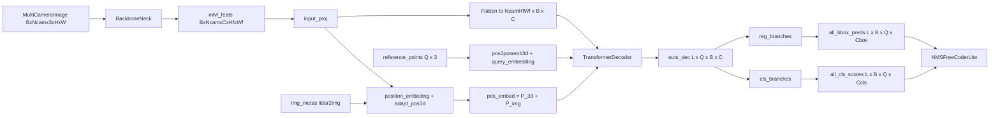

# PETR Paper-to-Code Study Guide

This note maps PETR paper symbols/equations to the pure-PyTorch forward implementation in this repository.

Primary references:
- Paper: `papers/PETR.pdf`
- Implementation: `pytorch_implementation/perception/petr/`
- Intermediate tensor tests: `tests/perception/petr.py`

## 1) Canonical study setup (fixed debug run)

Use one setup so equation-to-tensor mapping stays stable across sections.

- Config:
  - `debug_forward_config(num_queries=48, decoder_layers=2, depth_num=6)`
- Input image:
  - `img`: `[B, Ncam, C, H, W] = [1, 6, 3, 96, 160]`
- Metadata (`img_metas`):
  - `img_shape`: per-camera `(96, 160, 3)`
  - `pad_shape`: per-camera `(96, 160, 3)`
  - `lidar2img`: `6 x (4x4)` projection matrices

Core dimensions under this setup:
- `embed_dims = 256`
- `num_classes = 10`
- `num_decoder_layers = 2`
- `num_queries = 48`
- `depth_num = 6`

Expected model outputs:
- `all_cls_scores`: `[L, B, Q, num_classes] = [2, 1, 48, 10]`
- `all_bbox_preds`: `[L, B, Q, code_size] = [2, 1, 48, 10]`

These are verified in `tests/perception/petr.py`.

## 2) Symbol dictionary (paper -> code tensors)

- `F_t^i` (camera feature for camera `i`) -> `mlvl_feats[0][:, i]`
- `P_img` (image-space positional signal) -> `sin_embed`
- `P_3d` (3D-aware positional signal) -> `coords_position_embeding`
- `P` (final memory key position) -> `pos_embed = P_3d + P_img`
- `r_q` (3D reference points for queries) -> `reference_points`
- `e_q` (query embedding) -> `query_embeds = query_embedding(pos2posemb3d(reference_points))`
- `H_l` (decoder hidden at layer `l`) -> `outs_dec[l]`
- `\hat{c}_l` (class logits layer `l`) -> `outputs_classes[l]`
- `\hat{b}_l` (box prediction layer `l`) -> `outputs_coords[l]`

Equation IDs below are stable and use `E<section>.<index>`.

---

## Chunk 0 - End-to-end forward contract

### Goal
Bind PETR high-level pipeline to concrete module calls.

### Paper concept/equation
PETR performs object-query decoding from multi-view image memory with 3D position cues.

### Explicit equations
`(E0.1)` Feature extraction and decoding:

$$
F_t = \mathrm{ImageEncoder}(I_t), \quad H = \mathrm{Decoder}(Q, F_t, P), \quad \hat{Y} = \mathrm{Head}(H)
$$

`(E0.2)` Layer-wise outputs:

$$
\hat{Y} = \{(\hat{c}_l, \hat{b}_l)\}_{l=1}^{L}
$$

### Symbol table (E0.*)
- `I_t`: multi-camera image tensor
- `F_t`: multi-camera memory features
- `Q`: object queries
- `P`: positional embedding added to memory keys
- `\hat{Y}`: class and box predictions across decoder layers

### Code mapping
- `PETRLite.forward` in `pytorch_implementation/perception/petr/model.py`
- `PETRLite.extract_img_feat` in `pytorch_implementation/perception/petr/model.py`
- `PETRHeadLite.forward` in `pytorch_implementation/perception/petr/head.py`

### Tensor shape notes
- Input image: `[B, Ncam, 3, H, W]`
- Head outputs: `all_cls_scores [L, B, Q, Ccls]`, `all_bbox_preds [L, B, Q, Cbox]`

### One sanity check
`tests/perception/petr.py` asserts final output shapes for the debug config.

---

## Chunk 1 - Image features (backbone + neck)

### Goal
Understand how camera images are flattened, encoded, and restored to camera-major shape.

### Paper concept/equation
Each camera image is processed by shared CNN weights, then fused as a multi-view memory set.

### Explicit equations
`(E1.1)` Camera-batch flattening:

$$
I_t \in \mathbb{R}^{B\times N_{cam}\times 3\times H\times W}
\rightarrow
I'_t \in \mathbb{R}^{(B\cdot N_{cam})\times 3\times H\times W}
$$

`(E1.2)` Feature reshape back to camera axis:

$$
F'_t \in \mathbb{R}^{(B\cdot N_{cam})\times C\times H_f\times W_f}
\rightarrow
F_t \in \mathbb{R}^{B\times N_{cam}\times C\times H_f\times W_f}
$$

### Symbol table (E1.*)
- `N_cam`: number of cameras
- `H_f, W_f`: feature-map size after backbone/neck
- `C`: neck output channels

### Code mapping
- `BackboneNeck` in `pytorch_implementation/perception/petr/backbone_neck.py`
- `extract_img_feat` in `pytorch_implementation/perception/petr/model.py`

### Tensor shape notes
- Debug run yields `fpn.output0` shape `[6, 256, 6, 10]`
- After reshape: `[1, 6, 256, 6, 10]`

### One sanity check
`tests/perception/petr.py` validates backbone stage and `fpn.output0` shapes.

---

## Chunk 2 - 3D position embedding from geometry

### Goal
Connect PETR's 3D coordinate lifting with implemented tensor operations.

### Paper concept/equation
Image-grid points with sampled depths are lifted through inverse camera projection to 3D and normalized in a predefined range.

### Explicit equations
`(E2.1)` Pixel-depth homogeneous point:

$$
\tilde{p}(u,v,d) = [u\cdot d, v\cdot d, d, 1]^T
$$

`(E2.2)` Lift to 3D (lidar/world frame proxy):

$$
p_{3d} = T^{-1}_{lidar2img}\,\tilde{p}
$$

`(E2.3)` Range normalization:

$$
\bar{p}_{3d} = \frac{p_{3d} - p_{min}}{p_{max} - p_{min}}
$$

### Symbol table (E2.*)
- `(u,v)`: image coordinates at feature resolution
- `d`: sampled depth bin
- `T_{lidar2img}`: camera projection matrix from metadata
- `p_min, p_max`: `position_range` bounds

### Code mapping
- `PETRHeadLite.position_embeding` in `pytorch_implementation/perception/petr/head.py`
- `inverse_sigmoid` in `pytorch_implementation/perception/petr/utils.py`
- `position_encoder` in `pytorch_implementation/perception/petr/head.py`

### Tensor shape notes
- Pre-conv geometry tensor: `[B*Ncam, 3*D, H_f, W_f]`
- Encoded 3D positional feature: `[B, Ncam, C, H_f, W_f]`

### One sanity check
`head.position_encoder` hook is asserted to output `[B*Ncam, C, H_f, W_f]`.

---

## Chunk 3 - Query construction from 3D reference points

### Goal
Map learned reference anchors to decoder query embeddings.

### Paper concept/equation
PETR uses learnable 3D reference points and sinusoidal embedding to parameterize object queries.

### Explicit equations
`(E3.1)` Learnable reference points:

$$
r_q \in \mathbb{R}^{Q\times 3}
$$

`(E3.2)` Query embedding:

$$
e_q = \mathrm{MLP}(\mathrm{PE}_{3d}(r_q))
$$

### Symbol table (E3.*)
- `Q`: number of object queries
- `r_q`: normalized 3D reference points
- `\mathrm{PE}_{3d}`: sinusoidal embedding (`pos2posemb3d`)
- `e_q`: decoder query positional embedding

### Code mapping
- `reference_points` and `query_embedding` in `pytorch_implementation/perception/petr/head.py`
- `pos2posemb3d` in `pytorch_implementation/perception/petr/utils.py`

### Tensor shape notes
- `reference_points.weight`: `[Q, 3]`
- `query_embeds`: `[Q, C]`

### One sanity check
Tests assert `head.reference_points` and `head.query_embedding` output shapes.

---

## Chunk 4 - Transformer decoder over multi-view memory

### Goal
Describe how flattened memory and query tokens interact through self/cross attention.

### Paper concept/equation
PETR decodes object tokens using decoder layers: self-attention, cross-attention to image memory, and FFN refinement.

### Explicit equations
`(E4.1)` Memory flattening:

$$
M \in \mathbb{R}^{(N_{cam}H_fW_f)\times B\times C}
$$

`(E4.2)` Decoder layer update:

$$
H_l = \mathrm{FFN}(\mathrm{CrossAttn}(\mathrm{SelfAttn}(H_{l-1})))
$$

### Symbol table (E4.*)
- `M`: flattened memory tokens from camera features
- `H_l`: decoder hidden state at layer `l`
- `L`: number of decoder layers

### Code mapping
- `PETRTransformerLite.forward` in `pytorch_implementation/perception/petr/transformer.py`
- `PETRTransformerDecoderLayerLite` in `pytorch_implementation/perception/petr/transformer.py`

### Tensor shape notes
- Decoder hidden per layer: `[Q, B, C]`
- Stacked decoder output: `[L, Q, B, C]`

### One sanity check
Tests verify each `decoder.layer*`, `self_attn`, `cross_attn`, and `ffn` output has shape `[Q, B, C]`.

---

## Chunk 5 - Class/box heads and metric-space decoding

### Goal
Map decoder states to class logits and 3D box predictions.

### Paper concept/equation
Each decoder layer predicts class scores and box parameters; center dimensions tied to reference points use inverse-sigmoid residual updates.

### Explicit equations
`(E5.1)` Per-layer predictions:

$$
\hat{c}_l = f_{cls}(H_l), \quad \hat{b}_l = f_{reg}(H_l)
$$

`(E5.2)` Reference-aware center update:

$$
\hat{x},\hat{y}=\sigma(\Delta_{xy}+\sigma^{-1}(r_{xy})), \quad
\hat{z}=\sigma(\Delta_{z}+\sigma^{-1}(r_{z}))
$$

`(E5.3)` Scale normalized centers to metric range:

$$
x = \hat{x}(x_{max}-x_{min}) + x_{min}
$$

and similarly for `y, z`.

### Symbol table (E5.*)
- `f_cls, f_reg`: layer-specific MLP heads
- `r_xy, r_z`: reference point components
- `\Delta_{xy}, \Delta_z`: residual outputs from regression branch

### Code mapping
- Layer branches in `PETRHeadLite._build_branches`
- Forward update equations in `PETRHeadLite.forward`
- Top-k decode in `NMSFreeCoderLite` (`pytorch_implementation/perception/petr/postprocess.py`)

### Tensor shape notes
- `all_cls_scores`: `[L, B, Q, num_classes]`
- `all_bbox_preds`: `[L, B, Q, code_size]`
- Decoded inference set uses the last layer (`[-1]`) and top-k over `Q * num_classes`.

### One sanity check
Tests assert class/box branch output dimensions for every decoder layer and finite values for all captured outputs.

---

## 3) Dataflow diagram

## 4) One end-to-end tensor trace

1. Start with `img [1, 6, 3, 96, 160]`.
2. Backbone+FPN returns one level `[1, 6, 256, 6, 10]`.
3. `input_proj` projects to `[6, 256, 6, 10]`.
4. `position_embeding` lifts pixel-depth points to 3D and encodes: `coords_position_embedding [1, 6, 256, 6, 10]`.
5. Sine 2D positional encoding + `adapt_pos3d`: `sin_embed [1, 6, 256, 6, 10]`.
6. `pos_embed = coords_position_embedding + sin_embed`: `[1, 6, 256, 6, 10]`.
7. Flatten camera memory: `memory [360, 1, 256]` (6 cams * 6 * 10 = 360 tokens).
8. `key_pos` flattened similarly: `[360, 1, 256]`.
9. `key_padding_mask`: `[1, 360]`.
10. Reference points: `[48, 3]` -> `pos2posemb3d` -> `query_embeds [48, 256]`.
11. Query initialization: `target = zeros [48, 1, 256]`, `query_pos [48, 1, 256]`.
12. Run 2 decoder layers (self-attn -> cross-attn -> FFN):
    - each layer output `[48, 1, 256]`.
13. Stacked intermediate: `outs_dec [2, 48, 1, 256]` -> permuted to `[2, 1, 48, 256]`.
14. Per-layer cls/reg branches with reference-aware updates:
    - `all_cls_scores [2, 1, 48, 10]`
    - `all_bbox_preds [2, 1, 48, 10]`.
15. NMS-free decode selects top-k candidates and outputs final boxes/scores/labels.

## 5) Study drills (self-check questions)

1. Why does PETR use depth bins to lift 2D image points to 3D instead of estimating explicit depth?
2. What concrete tensors correspond to paper symbols `F_t`, `P_3d`, and `r_q`?
3. How does `position_embeding` decide which 3D points are out of range, and what mask does it produce?
4. Why are query embeddings derived from 3D reference points via sinusoidal encoding rather than being fully learned?
5. What changes in the `coords_position_embedding` tensor if you double `depth_num`?
6. Where exactly does `pos_embed = P_3d + P_img` happen in the code?
7. Why does the decoder use `key_padding_mask` based on image/pad shapes?
8. Which box coordinates use the reference-aware sigmoid residual update (`inverse_sigmoid`) vs. direct regression?
9. What is the role of `adapt_pos3d` — why not use `sin_embed` directly?
10. If all cameras had identical `lidar2img` matrices, what symmetry would you see in the 3D position embeddings?

## 6) Practical reading order for this note

1. Read Sections 1 and 2 once.
2. Walk through Chunk 1 (backbone) then Chunk 2 (3D position embedding) to understand inputs.
3. Study Chunk 3 (query construction from reference points).
4. Study Chunk 4 (decoder layers).
5. Study Chunk 5 (heads and decode).
6. Re-read Chunk 0 (end-to-end) to tie the full pipeline together.
7. Re-run the end-to-end trace in Section 4 while stepping through code.
8. Answer study drills without looking at code, then verify.

## 7) Strict parity notes and pure-PyTorch replacements

- Behavioral parity is pinned to frozen PETR anchor files in `study/markdown/strict_parity_anchor_manifest.md`.
- Geometry-aware 3D positional encoding uses validated `lidar2img -> img2lidar` transforms with strict metadata checks.
- Decoder keeps PETR reference-point regression semantics per layer, and decode uses denormalized box semantics aligned with NMS-free coder behavior.
- Framework/CUDA dependencies are replaced with pure PyTorch module composition and tensor ops only.
