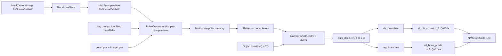

# PolarFormer Paper-to-Code Study Guide

This note maps PolarFormer symbols/equations to the pure-PyTorch forward implementation in this repository.

Primary references:
- Paper: `papers/PolarFormer.pdf`
- Reference repo lineage: `repos/PolarFormer/`
- Implementation: `pytorch_implementation/polarformer/`
- Intermediate tensor tests: `tests/polarformer/test_intermediate_tensors.py`

## 1) Canonical study setup (fixed debug run)

Use one setup so equation-to-tensor mapping stays stable across sections.

- Config:
  - `debug_forward_config(num_queries=48, decoder_layers=2, azimuth_bins=96, radius_bins=48)`
- Input image:
  - `img`: `[B, Ncam, C, H, W] = [1, 6, 3, 96, 160]`
- Metadata (`img_metas`):
  - `lidar2img`: `6 x (4x4)` projection matrices
  - `cam_intrinsic`: `6 x (3x3)` intrinsics
  - `cam2lidar`: `6 x (4x4)` extrinsics
  - `img_shape` / `pad_shape`: per-camera `(96, 160, 3)`

Core dimensions under this setup:
- `embed_dims = 256`
- `num_classes = 10`
- `num_decoder_layers = 2`
- `num_queries = 48`
- Polar output sizes by level:
  - L0: `[R, A] = [48, 96]`
  - L1: `[24, 48]`
  - L2: `[12, 24]`

Expected model outputs:
- `all_cls_scores`: `[L, B, Q, num_classes] = [2, 1, 48, 10]`
- `all_bbox_preds`: `[L, B, Q, code_size] = [2, 1, 48, 10]`

These are verified in `tests/polarformer/test_intermediate_tensors.py`.

## 2) Symbol dictionary (paper -> code tensors)

- `I_t^i` (camera image `i`) -> `img[:, i]`
- `F_t^i` (camera feature map `i`) -> `level_feat[:, cam_idx]` in `BackboneNeck.forward`
- `P_img` (image-column positional code) -> `image_pos`
- `P_polar` (polar-ray positional code) -> `polar_pos`
- `R_i` (polar rays generated from camera `i`) -> `polar_feat` from `_project_single_camera`
- `M` (flattened multi-scale memory) -> `memory` in `PolarTransformerLite.forward`
- `Q` (object queries) -> `query_embeds` from `head.query_embedding`
- `r_q` (3D reference points for query `q`) -> `init_reference`
- `H_l` (decoder hidden state at layer `l`) -> `outs_dec[l]`
- `\hat{c}_l` (class logits layer `l`) -> `outputs_classes[l]`
- `\hat{b}_l` (box prediction layer `l`) -> `outputs_coords[l]`

Equation IDs below are stable and use `E<section>.<index>`.

---

## Chunk 0 - End-to-end forward contract

### Goal
Bind PolarFormer high-level pipeline to concrete module calls.

### Paper concept/equation
PolarFormer projects multi-camera image features to polar BEV features, then decodes object queries for 3D predictions.

### Explicit equations
`(E0.1)` Camera feature extraction and polar projection:

$$
F_t = \mathrm{PolarNeck}(\mathrm{ImageEncoder}(I_t))
$$

`(E0.2)` Query decoding and prediction:

$$
H = \mathrm{Decoder}(Q, F_t), \quad \hat{Y} = \{(\hat{c}_l, \hat{b}_l)\}_{l=1}^{L}
$$

### Code mapping
- `PolarFormerLite.forward` in `pytorch_implementation/polarformer/model.py`
- `BackboneNeck.forward` in `pytorch_implementation/polarformer/backbone_neck.py`
- `PolarFormerHeadLite.forward` in `pytorch_implementation/polarformer/head.py`

### One sanity check
`tests/polarformer/test_intermediate_tensors.py` asserts final output tensor shapes.

---

## Chunk 1 - Camera features to polar rays

### Goal
Understand how each camera contributes to a polar ray grid.

### Paper concept/equation
PolarFormer uses image columns as keys/values and polar rays as queries to build camera-specific polar features.

### Explicit equations
`(E1.1)` Image column tokens:

$$
X_i \in \mathbb{R}^{H \times (B\cdot W) \times C}
$$

`(E1.2)` Polar ray queries and cross-attention:

$$
R_i = \mathrm{CrossAttn}(Q_{polar}, X_i, X_i)
$$

`(E1.3)` Camera fusion:

$$
R = \frac{1}{N_{cam}}\sum_{i=1}^{N_{cam}} R_i
$$

### Code mapping
- `PolarRayCrossAttentionLite.forward` in `pytorch_implementation/polarformer/backbone_neck.py`
- camera loop in `BackboneNeck.forward`

### Tensor shape notes
- Projector output per level: `[R_l, B \cdot W_l, C]`
- Fused level output: `[B, C, R_l, A_l]`

### One sanity check
Tests assert `polar.projector{l}` and `polar.output{l}` shapes for all 3 levels.

---

## Chunk 2 - Multi-level polar memory + decoder

### Goal
Connect multi-level polar maps to query decoding.

### Paper concept/equation
Flatten all polar levels into one memory bank and decode object queries with self-attention and cross-attention.

### Explicit equations
`(E2.1)` Multi-level flatten:

$$
M = \mathrm{Concat}_l(\mathrm{Flatten}(F_l))
$$

`(E2.2)` Decoder layer update:

$$
H_l = \mathrm{FFN}(\mathrm{CrossAttn}(\mathrm{SelfAttn}(H_{l-1}), M))
$$

`(E2.3)` Reference points from query positional part:

$$
r_q = \sigma(W_r q_{pos})
$$

### Code mapping
- `PolarTransformerLite.forward` in `pytorch_implementation/polarformer/transformer.py`
- `PolarTransformerDecoderLayerLite` in `pytorch_implementation/polarformer/transformer.py`

### Tensor shape notes
- Decoder hidden per layer: `[Q, B, C]`
- Stacked decoder output: `[L, Q, B, C]`
- Initial references: `[B, Q, 3]`

### One sanity check
Tests verify each decoder layer, self-attention, cross-attention, and FFN output has shape `[Q, B, C]`.

---

## Chunk 3 - Polar box parameters to Cartesian center

### Goal
Map normalized polar predictions to metric-space box centers.

### Paper concept/equation
The head predicts normalized polar angle/radius and height, then converts `(theta, r)` to Cartesian `(x, y)`.

### Explicit equations
`(E3.1)` Reference-aware normalized updates:

$$
\hat{\theta}, \hat{r} = \sigma(\Delta_{\theta r} + \sigma^{-1}(r_{\theta r})), \quad
\hat{z} = \sigma(\Delta_z + \sigma^{-1}(r_z))
$$

`(E3.2)` Scale to metric polar coordinates:

$$
\theta = 2\pi\hat{\theta}, \quad
r = \hat{r}(r_{max} - r_{min}) + r_{min}
$$

`(E3.3)` Polar-to-Cartesian center conversion:

$$
x = r\sin(\theta), \quad y = r\cos(\theta)
$$

### Code mapping
- regression update + conversion in `PolarFormerHeadLite.forward`
- decode in `NMSFreeCoderLite.decode` (`pytorch_implementation/polarformer/postprocess.py`)

### Tensor shape notes
- `all_cls_scores`: `[L, B, Q, num_classes]`
- `all_bbox_preds`: `[L, B, Q, code_size]`

### One sanity check
Tests assert finite values for all hooked intermediates and all final outputs.

---

## 3) Dataflow diagram

## 4) One end-to-end tensor trace

1. Start with `img [1, 6, 3, 96, 160]`.
2. Backbone+FPN returns multi-level features:
   - Level 0: `[1, 6, 256, 6, 10]`
   - Level 1: `[1, 6, 256, 3, 5]`
   - Level 2: `[1, 6, 256, 2, 3]` (approximate, depends on backbone strides).
3. Per-camera per-level polar cross-attention:
   - For each camera, project image columns into polar rays.
   - Polar output level 0: `[R, A] = [48, 96]` -> `[4608, 256]` tokens.
   - Level 1: `[24, 48]` -> `[1152, 256]`.
   - Level 2: `[12, 24]` -> `[288, 256]`.
4. Flatten and concatenate all levels into memory:
   - `memory [6048, 1, 256]` (4608 + 1152 + 288).
   - `spatial_shapes [[48, 96], [24, 48], [12, 24]]`.
5. Object queries: `query_embeds [48, 512]` split into `query_pos [48, 256]` and `query [48, 256]`.
6. Initial reference points from linear + sigmoid: `init_reference [1, 48, 3]`.
7. Run 2 decoder layers (self-attn -> cross-attn to polar memory -> FFN):
   - each layer output `[48, 1, 256]`.
8. Per-layer cls/reg branches with iterative reference refinement:
   - `all_cls_scores [2, 1, 48, 10]`
   - `all_bbox_preds [2, 1, 48, 10]`.
9. NMS-free decode selects top-k candidates and outputs final 3D boxes.

## 5) Study drills (self-check questions)

1. Why does PolarFormer use a polar coordinate system for BEV encoding instead of Cartesian?
2. What concrete tensors correspond to paper symbols `R_i`, `P_polar`, and `M`?
3. How does `_project_single_camera` map image columns to polar rays?
4. Why does the model process each camera independently in the polar cross-attention rather than jointly?
5. What happens to polar memory resolution at different FPN levels?
6. How are `polar_pos` and `image_pos` used to inject geometric awareness into cross-attention?
7. Why does the decoder use iterative reference-point refinement rather than direct regression?
8. How does `inverse_sigmoid` participate in the reference-point update?
9. What would happen if all cameras had the same `cam2lidar` — how would polar projections differ?
10. Why is multi-scale polar memory important — could you use a single scale?

## 6) Practical reading order for this note

1. Read Sections 1 and 2 once.
2. Walk through Chunk 1 (backbone and polar cross-attention) — understand the polar representation.
3. Study Chunk 2 (multi-scale polar memory and decoder structure).
4. Study Chunk 3 (detection heads and reference refinement).
5. Re-read Chunk 0 (end-to-end) to tie the full pipeline together.
6. Re-run the tensor trace in Section 4 while stepping through code.
7. Answer study drills without looking at code, then verify.

## 7) Known implementation simplifications in this repo

- Polar cross-attention uses `grid_sample` rather than custom polar CUDA kernels.
- Azimuth and radius bin counts are configurable but kept small in the debug config.
- No multi-frame temporal fusion — each frame is processed independently.
- Uses standard `nn.MultiheadAttention` in the decoder instead of deformable attention.

These simplifications keep the PolarFormer concept flow explicit for study.

