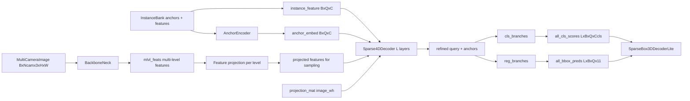

# Sparse4D Paper-to-Code Study Guide

This note maps Sparse4D paper symbols/equations to the pure-PyTorch forward implementation in this repository.

Primary references:
- Paper: `papers/Sparse4D.pdf`
- Paper (online mirror): [Sparse4D v2: Recurrent Temporal Fusion with Sparse Model (arXiv 2305.14018)](https://arxiv.org/pdf/2305.14018.pdf)
- Reference code (online): [linxuewu/Sparse4D](https://github.com/linxuewu/Sparse4D)
- Implementation: `pytorch_implementation/sparse4d/`
- Intermediate tensor tests: `tests/sparse4d/test_intermediate_tensors.py`

## 1) Canonical study setup (fixed debug run)

Use one setup so equation-to-tensor mapping stays stable across sections.

- Config:
  - `debug_forward_config(num_queries=48, decoder_layers=2)`
- Input image:
  - `img`: `[B, Ncam, C, H, W] = [1, 6, 3, 96, 160]`
- Metadata:
  - `projection_mat`: `[B, Ncam, 4, 4]`
  - `image_wh`: `[B, Ncam, 2]`

Core dimensions:
- `embed_dims = 256`
- `num_classes = 10`
- `num_decoder_layers = 2`
- `num_queries = 48`
- `box_code_size = 11`

Expected model outputs:
- `all_cls_scores`: `[L, B, Q, num_classes] = [2, 1, 48, 10]`
- `all_bbox_preds`: `[L, B, Q, 11] = [2, 1, 48, 11]`

These are verified in `tests/sparse4d/test_intermediate_tensors.py`.

## 2) Symbol dictionary (paper -> code tensors)

- `I_t` (multi-view image) -> `img`
- `F_t` (multi-level image features) -> `mlvl_feats`
- `Q_t` (instance query features) -> `instance_feature`
- `A_t` (instance anchors) -> `anchors`
- `E(A_t)` (anchor embedding) -> `anchor_embed`
- `H_l` (decoder hidden at layer `l`) -> `query` after `decoder.layers[l]`
- `\hat{c}_l` (class logits, layer `l`) -> `all_cls_scores[l]`
- `\hat{b}_l` (box prediction, layer `l`) -> `all_bbox_preds[l]`

Equation IDs below use `E<section>.<index>`.

---

## Chunk 0 - End-to-end forward contract

### Goal
Bind Sparse4D high-level pipeline to concrete module calls.

### Explicit equations
`(E0.1)` Forward path:

$$
F_t = \mathrm{ImageEncoder}(I_t),\;
(Q_t, A_t) = \mathrm{InstanceBank}(),\;
\hat{Y} = \mathrm{Head}(F_t, Q_t, A_t)
$$

`(E0.2)` Layer-wise outputs:

$$
\hat{Y} = \{(\hat{c}_l, \hat{b}_l)\}_{l=1}^{L}
$$

### Code mapping
- `Sparse4DLite.forward` and `Sparse4DLite.extract_img_feat` in `pytorch_implementation/sparse4d/model.py`
- `Sparse4DHeadLite.forward` in `pytorch_implementation/sparse4d/head.py`

### One sanity check
`tests/sparse4d/test_intermediate_tensors.py` asserts final output shapes for the debug config.

---

## Chunk 1 - Image feature extraction

### Goal
Map multi-camera image flattening and multi-level feature construction.

### Explicit equations
`(E1.1)` Camera-batch flattening:

$$
I_t \in \mathbb{R}^{B\times N_{cam}\times 3\times H\times W}
\rightarrow
I'_t \in \mathbb{R}^{(B\cdot N_{cam})\times 3\times H\times W}
$$

`(E1.2)` Multi-level features with camera reshape:

$$
F'_t{}^{(k)} \in \mathbb{R}^{(B\cdot N_{cam})\times C\times H_k\times W_k}
\rightarrow
F_t^{(k)} \in \mathbb{R}^{B\times N_{cam}\times C\times H_k\times W_k}
$$

### Code mapping
- `BackboneNeck` in `pytorch_implementation/sparse4d/backbone_neck.py`
- `extract_img_feat` in `pytorch_implementation/sparse4d/model.py`

### One sanity check
Tests validate `backbone.stage*` and `neck.output*` tensor shapes at each level.

---

## Chunk 2 - Instance bank and anchor encoding

### Goal
Connect Sparse4D sparse query initialization to concrete tensors.

### Explicit equations
`(E2.1)` Learnable sparse instance state:

$$
Q_t = \mathrm{Repeat}(Q_0, B),\;
A_t = \mathrm{Repeat}(A_0, B)
$$

`(E2.2)` Anchor encoding:

$$
E(A_t) = \mathrm{MLP}(A_t)
$$

### Code mapping
- `InstanceBankLite` in `pytorch_implementation/sparse4d/instance_bank.py`
- `SparseBox3DEncoderLite` in `pytorch_implementation/sparse4d/blocks.py`
- Assembly in `Sparse4DHeadLite.forward` (`pytorch_implementation/sparse4d/head.py`)

### One sanity check
Tests assert shapes for `head.instance_bank` and `head.anchor_encoder`.

---

## Chunk 3 - Decoder updates with image aggregation

### Goal
Map per-layer Sparse4D update blocks to the implemented decoder.

### Explicit equations
`(E3.1)` Query initialization:

$$
H_0 = Q_t + E(A_t)
$$

`(E3.2)` Decoder layer update:

$$
H_l = \mathrm{FFN}\Big(\mathrm{CrossAgg}(\mathrm{SelfAttn}(H_{l-1}, H_{l-1}, H_{l-1}), F_t)\Big)
$$

### Code mapping
- `SparseDecoderLayerLite` in `pytorch_implementation/sparse4d/blocks.py`
- `Sparse4DDecoderLite` loop in `pytorch_implementation/sparse4d/decoder.py`
- `DeformableFeatureAggregationLite` as a pure-PyTorch image-context surrogate in `pytorch_implementation/sparse4d/blocks.py`

### One sanity check
Tests verify `decoder.layer*`, `self_attn`, `cross_attn`, and `ffn` output shapes.

---

## Chunk 4 - Layer-wise class/box refinement and decode

### Goal
Map query states to class logits, box refinement, and final top-k decode.

### Explicit equations
`(E4.1)` Per-layer predictions:

$$
\hat{c}_l = f_{cls}(H_l),\;
\Delta b_l = f_{reg}(H_l),\;
\hat{b}_l = A_{l-1} + \Delta b_l
$$

`(E4.2)` Iterative anchor update:

$$
A_l = \mathrm{stopgrad}(\hat{b}_l)
$$

`(E4.3)` NMS-free top-k decode:

$$
(\mathrm{score}, \mathrm{label}, \mathrm{box}) =
\mathrm{TopK}(\sigma(\hat{c}_L), \hat{b}_L)
$$

### Code mapping
- `SparseBox3DRefinementLite` in `pytorch_implementation/sparse4d/blocks.py`
- Iterative updates in `Sparse4DDecoderLite.forward` (`pytorch_implementation/sparse4d/decoder.py`)
- `SparseBox3DDecoderLite.decode` in `pytorch_implementation/sparse4d/decoder.py`
- `Sparse4DHeadLite.get_bboxes` in `pytorch_implementation/sparse4d/head.py`

### One sanity check
Tests assert head branch output shapes and finite values for all captured intermediates/final tensors.

---

## 3) Dataflow diagram

## 4) One end-to-end tensor trace

1. Start with `img [1, 6, 3, 96, 160]`.
2. Backbone+FPN returns multi-level features (e.g., 4 levels with varying spatial sizes).
3. Feature projection aligns channel dims: each level `[1, 6, 256, Hl, Wl]`.
4. Instance bank provides:
   - `anchors [1, 48, 11]` (3D anchor parameters: center, size, rotation, velocity)
   - `instance_feature [1, 48, 256]` (query features).
5. Anchor encoder embeds anchors: `anchor_embed [1, 48, 256]`.
6. Run 2 decoder layers, each consisting of:
   - Self-attention among queries: `[1, 48, 256]`.
   - Deformable feature aggregation (sample from multi-view multi-level features).
   - FFN refinement.
   - Anchor refinement: update `anchors [1, 48, 11]`.
7. Per-layer head branches:
   - `all_cls_scores [2, 1, 48, 10]`
   - `all_bbox_preds [2, 1, 48, 11]`.
8. Box decoder converts anchor codes to metric 3D boxes, top-k selection.

## 5) Study drills (self-check questions)

1. Why does Sparse4D use explicit 3D anchors rather than learned reference points like DETR?
2. What concrete tensors correspond to paper symbols `Q_t`, `A_t`, and `E(A_t)`?
3. How does `AnchorEncoder` convert an 11-D anchor to an embedding — what is the architecture?
4. What is "deformable feature aggregation" and how does it differ from standard cross-attention?
5. Why does anchor refinement happen at every decoder layer rather than only at the end?
6. How does `projection_mat` connect 3D anchor locations to 2D image sampling points?
7. What is the role of `image_wh` in the sampling process?
8. Why is `box_code_size = 11` — what are the 11 components?
9. How does the instance bank persist across frames in the temporal variant?
10. What would happen if you removed anchor refinement and kept anchors fixed?

## 6) Practical reading order for this note

1. Read Sections 1 and 2 once.
2. Walk through Chunk 1 (backbone and anchor encoding) — understand inputs.
3. Study Chunk 2 (decoder with self-attention and deformable aggregation).
4. Study Chunk 3 (anchor refinement per layer).
5. Study Chunk 4 (detection heads and box decode).
6. Re-read Chunk 0 (end-to-end) to tie the full pipeline together.
7. Re-run the tensor trace in Section 4 while stepping through code.
8. Answer study drills without looking at code, then verify.

## 7) Known implementation simplifications in this repo

- Deformable feature aggregation uses pure PyTorch `grid_sample` instead of custom CUDA operators.
- No temporal recurrence in the instance bank for the debug config (single-frame mode).
- Anchor initialization is from learned embeddings rather than data-driven proposals.
- Multi-level feature projection uses simple linear layers.

These simplifications keep the Sparse4D concept flow explicit for study.
