# StreamPETR Paper-to-Code Study Guide

This note maps StreamPETR paper symbols/equations to the pure-PyTorch forward implementation in this repository.

Primary references:
- Paper: [arXiv:2303.11926](https://arxiv.org/abs/2303.11926) (local `papers/StreamPETR.pdf` not present in this worktree)
- Reference code: [exiawsh/StreamPETR](https://github.com/exiawsh/StreamPETR)
- Implementation: `pytorch_implementation/streampetr/`
- Intermediate tensor tests: `tests/streampetr/test_intermediate_tensors.py`

## 1) Canonical study setup (fixed debug run)

Use one setup so equation-to-tensor mapping stays stable across sections.

- Config:
  - `debug_forward_config(num_queries=48, decoder_layers=2, depth_num=6, memory_len=40, topk_proposals=12, num_propagated=8)`
- Input image:
  - `img`: `[B, Ncam, C, H, W] = [1, 6, 3, 96, 160]`
- Metadata (`img_metas`):
  - `img_shape`: per-camera `(96, 160, 3)`
  - `pad_shape`: per-camera `(96, 160, 3)`
  - `lidar2img`: `6 x (4x4)` projection matrices
- Frame flags:
  - first frame uses `prev_exists=0` (memory reset)
  - second frame uses `prev_exists=1` (memory propagation)

Core dimensions under this setup:
- `embed_dims = 256`
- `num_classes = 10`
- `num_decoder_layers = 2`
- `num_queries = 48`
- `num_propagated = 8`
- `memory_len = 40`

Expected model outputs:
- `all_cls_scores`: `[L, B, Q, num_classes] = [2, 1, 48, 10]`
- `all_bbox_preds`: `[L, B, Q, code_size] = [2, 1, 48, 10]`

These are verified in `tests/streampetr/test_intermediate_tensors.py`.

## 2) Symbol dictionary (paper -> code tensors)

- `F_t` (multi-view image memory at frame `t`) -> `x` / flattened `memory` in `StreamPETRHeadLite.forward`
- `Q_t` (object queries at frame `t`) -> `query_pos`, `tgt`
- `\tilde{Q}_{t-1}` (propagated object states) -> `memory_embedding[:, :num_propagated]`
- `R_t` (reference points for queries) -> `reference_points`
- `P_3d` (3D position embedding) -> `coords_position_embeding`
- `P_img` (2D sine image position embedding) -> `sin_embed`
- `P_t` (final key positional signal) -> `pos_embed = P_3d + P_img`
- `H_l^t` (decoder hidden state at layer `l`) -> `outs_dec_main[l]`
- `\hat{c}_l^t` (class logits at layer `l`) -> `all_cls_scores[l]`
- `\hat{b}_l^t` (box outputs at layer `l`) -> `all_bbox_preds[l]`
- `M_t` (memory bank after update) -> `memory_embedding`, `memory_reference_point`, `memory_timestamp`

Equation IDs below are stable and use `E<section>.<index>`.

---

## Chunk 0 - End-to-end StreamPETR contract

### Goal
Bind StreamPETR high-level temporal pipeline to concrete module calls.

### Explicit equations
`(E0.1)` Frame-wise object-centric temporal decoding:

$$
F_t = \mathrm{ImageEncoder}(I_t), \quad
Q_t = \mathrm{TemporalAlign}(Q_t^{init}, M_{t-1}), \quad
H_t = \mathrm{Decoder}(Q_t, F_t, M_{t-1}), \quad
\hat{Y}_t = \mathrm{Head}(H_t)
$$

`(E0.2)` Memory bank update:

$$
M_t = \mathrm{UpdateMemory}(M_{t-1}, \hat{Y}_t, H_t)
$$

### Code mapping
- `StreamPETRLite.forward` in `pytorch_implementation/streampetr/model.py`
- `StreamPETRHeadLite.forward` in `pytorch_implementation/streampetr/head.py`
- `StreamPETRHeadLite.post_update_memory` in `pytorch_implementation/streampetr/head.py`

### One sanity check
The test runs two sequential frames and checks memory tensors change between frame 1 and frame 2.

---

## Chunk 1 - Multi-view feature extraction

### Goal
Map camera image flattening and feature restoration to tensor shapes.

### Explicit equations
`(E1.1)` Camera-batch flattening:

$$
I_t \in \mathbb{R}^{B\times N_{cam}\times 3\times H\times W}
\rightarrow
I'_t \in \mathbb{R}^{(B N_{cam})\times 3\times H\times W}
$$

`(E1.2)` Restore camera axis:

$$
F'_t \in \mathbb{R}^{(B N_{cam})\times C\times H_f\times W_f}
\rightarrow
F_t \in \mathbb{R}^{B\times N_{cam}\times C\times H_f\times W_f}
$$

### Code mapping
- `StreamPETRLite.extract_img_feat` in `pytorch_implementation/streampetr/model.py`
- `BackboneNeck` in `pytorch_implementation/streampetr/backbone_neck.py`

### One sanity check
`tests/streampetr/test_intermediate_tensors.py` validates backbone/FPN intermediate shapes.

---

## Chunk 2 - 3D geometry-aware positional encoding

### Goal
Connect depth lifting and camera projection inverse to implemented tensors.

### Explicit equations
`(E2.1)` Depth-lifted homogeneous image point:

$$
\tilde{p}(u,v,d) = [u d, v d, d, 1]^T
$$

`(E2.2)` Camera-image inverse projection:

$$
p_{3d} = T^{-1}_{lidar2img}\,\tilde{p}
$$

`(E2.3)` Position-range normalization:

$$
\bar{p}_{3d} = \frac{p_{3d} - p_{min}}{p_{max} - p_{min}}
$$

### Code mapping
- `StreamPETRHeadLite.position_embeding` in `pytorch_implementation/streampetr/head.py`
- `inverse_sigmoid` in `pytorch_implementation/streampetr/utils.py`
- `position_encoder` and `adapt_pos3d` in `pytorch_implementation/streampetr/head.py`

### One sanity check
Tests assert `head.position_encoder` and `head.adapt_pos3d` produce `[B*Ncam, C, Hf, Wf]`.

---

## Chunk 3 - Temporal alignment with object-centric memory

### Goal
Map propagated queries and temporal memory keys to code tensors.

### Explicit equations
`(E3.1)` Query augmentation with propagated memory:

$$
Q_t^{aug} = [Q_t^{init}; \tilde{Q}_{t-1}^{(1:K)}]
$$

`(E3.2)` Temporal positional modulation:

$$
P_t^{temp} = f_{q}(\mathrm{PE}_{3d}(R)) + f_{time}(\mathrm{PE}_{1d}(\tau))
$$

### Code mapping
- `StreamPETRHeadLite.temporal_alignment` in `pytorch_implementation/streampetr/head.py`
- `query_embedding`, `time_embedding` in `pytorch_implementation/streampetr/head.py`
- `pos2posemb3d`, `pos2posemb1d` in `pytorch_implementation/streampetr/utils.py`

### Tensor shape notes
- Decoder query count is `Q_total = Q + num_propagated` in this implementation.
- Main detection outputs are sliced back to the first `Q` queries.

### One sanity check
Tests assert decoder layer outputs use `Q_total`, while cls/reg branch outputs use `Q`.

---

## Chunk 4 - Temporal transformer decoding

### Goal
Show how current frame memory and historical memory are jointly attended.

### Explicit equations
`(E4.1)` Current image memory tokens:

$$
M_t^{img} \in \mathbb{R}^{(N_{cam}H_fW_f)\times B\times C}
$$

`(E4.2)` Cross-attention key composition:

$$
K_t = [M_t^{img}; M_{t-1}^{tail}]
$$

`(E4.3)` Decoder layer update:

$$
H_l^t = \mathrm{FFN}(\mathrm{CrossAttn}(\mathrm{SelfAttn}(H_{l-1}^t, Q_t^{aug}), K_t))
$$

### Code mapping
- `StreamPETRTemporalTransformerLite.forward` in `pytorch_implementation/streampetr/transformer.py`
- `StreamPETRTemporalDecoderLayerLite.forward` in `pytorch_implementation/streampetr/transformer.py`

### One sanity check
Tests verify each decoder layer/self-attn/cross-attn/ffn output shape is `[Q_total, B, C]`.

---

## Chunk 5 - Prediction heads and memory update

### Goal
Map per-layer predictions and top-k memory writing behavior.

### Explicit equations
`(E5.1)` Layer-wise head outputs:

$$
\hat{c}_l^t = f_{cls}(H_l^t), \quad \hat{b}_l^t = f_{reg}(H_l^t)
$$

`(E5.2)` Reference residual update for 3D center:

$$
\hat{r}_{xyz} = \sigma(\Delta_{xyz} + \sigma^{-1}(r_{xyz}))
$$

`(E5.3)` Top-k memory refresh from last layer:

$$
\mathcal{I}_k = \mathrm{TopK}(\max(\sigma(\hat{c}_L^t))), \quad
M_t = [H_L^t[\mathcal{I}_k]; M_{t-1}]_{:L_{mem}}
$$

### Code mapping
- cls/reg branches in `StreamPETRHeadLite._build_branches`
- prediction logic in `StreamPETRHeadLite.forward`
- memory write in `StreamPETRHeadLite.post_update_memory`

### One sanity check
Tests check memory bank shapes remain fixed and memory embedding changes between sequential frames.

---

## 3) Dataflow diagram

```mermaid
flowchart LR
    imgInput["MultiCameraImage BxNcamx3xHxW"] --> backboneNeck[BackboneNeck]
    backboneNeck --> mlvlFeats["mlvl_feats BxNcamxCxHfxWf"]
    mlvlFeats --> inputProj[input_proj]
    inputProj --> posEmbed["position_embeding + adapt_pos3d"]
    imgMetas["img_metas lidar2img"] --> posEmbed
    posEmbed --> keyPos["pos_embed = P_3d + P_img"]
    inputProj --> flattenMem["Flatten to NcamHfWf x B x C"]
    memoryBank["Memory Bank propagated queries"] --> augment["Augment key/value with temporal memory"]
    flattenMem --> augment
    keyPos --> augment
    augment --> decoder["TransformerDecoder L layers"]
    refPoints["reference_points + topk_proposals"] --> queryEmbed["pos2posemb3d + query_embedding"]
    queryEmbed --> decoder
    decoder --> outsDec["outs_dec L x Q x B x C"]
    outsDec --> clsBranch[cls_branches]
    outsDec --> regBranch[reg_branches]
    clsBranch --> clsScores["all_cls_scores LxBxQxCcls"]
    regBranch --> bboxPreds["all_bbox_preds LxBxQxCbox"]
    outsDec --> memUpdate["post_update_memory"]
    memUpdate --> memoryBank
    clsScores --> decode[NMSFreeCoderLite]
    bboxPreds --> decode
```

## 4) One end-to-end tensor trace

1. Start with `img [1, 6, 3, 96, 160]`.
2. Backbone+FPN returns one level `[1, 6, 256, 6, 10]`.
3. `input_proj` projects: `[6, 256, 6, 10]`.
4. `position_embeding` lifts pixel-depth grid to 3D: `coords_position_embeding [1, 6, 256, 6, 10]`.
5. Sine 2D PE + `adapt_pos3d`: `sin_embed [1, 6, 256, 6, 10]`.
6. `pos_embed = P_3d + P_img`: `[1, 6, 256, 6, 10]`.
7. Flatten camera memory: `[360, 1, 256]` (6 * 6 * 10 = 360 tokens).
8. Memory bank state (first frame: empty; second frame onward):
   - `memory_embedding [1, 40, 256]` (memory_len=40)
   - `memory_reference_point [1, 40, 3]`
   - `memory_timestamp [1, 40, 1]`.
9. Augmented key/value: current camera tokens + propagated memory tokens:
   - `memory [360 + 40, 1, 256] = [400, 1, 256]`
   - `pos_embed [400, 1, 256]`.
10. Query construction:
    - `reference_points [48, 3]` -> `pos2posemb3d` -> `query_pos [48, 256]`
    - Top-k proposals from memory contribute `num_propagated=8` queries.
    - `target = zeros [48, 1, 256]`.
11. Run 2 decoder layers (self-attn -> cross-attn to augmented memory -> FFN):
    - each layer output `[48, 1, 256]`.
12. Per-layer cls/reg branches with reference-aware update:
    - `all_cls_scores [2, 1, 48, 10]`
    - `all_bbox_preds [2, 1, 48, 10]`.
13. `post_update_memory`: write top-scoring queries back to memory bank.
14. NMS-free decode selects top-k candidates and outputs final boxes/scores/labels.

## 5) Study drills (self-check questions)

1. How does StreamPETR differ from PETR in handling temporal information?
2. What concrete tensors correspond to paper symbols `\tilde{Q}_{t-1}`, `M_t`, and `P_t`?
3. Why does StreamPETR augment the key/value set with memory rather than modifying the queries?
4. How does `memory_timestamp` help the model distinguish old vs. recent memory entries?
5. What happens on the first frame when `prev_exists=0` — how is the memory bank initialized?
6. How are `topk_proposals` selected from the memory, and why is `num_propagated` separate from `num_queries`?
7. Where does ego-motion compensation happen for the memory reference points between frames?
8. Why does StreamPETR inherit the 3D position-embedding approach from PETR?
9. What would happen if you set `memory_len=0` — does it reduce to vanilla PETR?
10. How does `post_update_memory` decide which queries to write into the memory bank?

## 6) Practical reading order for this note

1. Read Sections 1 and 2 once.
2. Walk through Chunk 1 (backbone + 3D position embedding) — shared with PETR.
3. Study Chunk 2 (memory propagation and temporal augmentation) — the core StreamPETR novelty.
4. Study Chunk 3 (query construction with propagated proposals).
5. Study Chunk 4 (decoder layers).
6. Study Chunk 5 (heads, memory update, and decode).
7. Re-read Chunk 0 (end-to-end) to tie the pipeline together.
8. Re-run the tensor trace in Section 4 while stepping through code.
9. Answer study drills without looking at code, then verify.

## 7) Known implementation simplifications in this repo

- Uses standard `nn.MultiheadAttention` instead of deformable attention.
- Single FPN level only (no multi-scale features).
- Memory bank uses simple FIFO update rather than learned gating.
- Ego-motion alignment for memory reference points uses a simplified transform.
- No data augmentation transforms in the geometry pipeline.

These simplifications keep the StreamPETR concept flow explicit for study.

