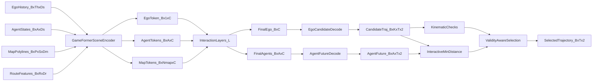

# GameFormer Planning Paper-to-Code (End-to-End)

This note links interactive planning concepts to the pure-PyTorch `planning/gameformer` implementation, including multi-level interaction refinement and agent-aware safety selection.

## 0) Scope and Artifacts

- Model key: `planning/gameformer`
- Implementation: `pytorch_implementation/planning/gameformer/`
- Tests: `tests/planning/gameformer.py`
- Notebook: `study/notebook/planning/gameformer_paper_to_code.ipynb`
- Paper: `papers/planning/gameformer.pdf`
- Reference repo: `repos/planning/gameformer/`

## 1) Canonical study setup (fixed dummy run)

Use one debug setup for consistent tensor tracing.

- Config call: `debug_forward_config()` from `pytorch_implementation/planning/gameformer/config.py`
- Core dimensions:
  - `history_steps = 4`
  - `future_steps = 6`
  - `num_agents = 8`
  - `map_polylines = 12`
  - `points_per_polyline = 6`
  - `hidden_dim = 64`
  - `num_candidates = 4`
  - `game_levels = 2`
  - `dt = 0.5`
- Synthetic batch from `build_debug_batch(cfg.e2e, batch_size=2)`:
  - `ego_history [2, 4, 6]`
  - `agent_states [2, 8, 6]`
  - `map_polylines [2, 12, 6, 2]`
  - `route_features [2, 16, 4]`

Expected outputs:
- `candidate_trajectories [2, 4, 6, 2]`
- `agent_future [2, 8, 6, 2]`
- `level_ego_tokens [2, 2, 64]`
- `level_agent_tokens [2, 2, 8, 64]`
- `selected_trajectory [2, 6, 2]`

## 2) Symbol dictionary (paper -> code tensors)

- `H^{ego}` -> `ego_history` `[B, Th, Ds]`
- `A` -> `agent_states` `[B, A, Ds]`
- `M` -> `map_polylines` `[B, P, S, Dm]`
- `e_l` -> ego token at interaction level `l`
- `a_l` -> agent tokens at interaction level `l`
- `\hat{Y}^{ego}` -> `candidate_trajectories` `[B, K, T, 2]`
- `\hat{A}` -> `agent_future` `[B, A, T, 2]`
- `\pi` -> `candidate_scores` `[B, K]`
- `d_{min}` -> `min_distance` `[B, K]`
- `\mathcal{F}_{kin}` -> `feasible_mask` `[B, K]`
- `\mathcal{C}_{safe}` -> `collision_free_mask` `[B, K]`

Equation ID convention used below: `E<chunk>.<index>`.

---

## Chunk 0 - End-to-End Interactive Planning Contract

### Goal
Predict ego trajectory candidates while explicitly modeling interactive agent futures and selecting a safe plan.

### Paper concept/equation
Interactive planning couples ego candidate generation with agent-future rollout so safety is evaluated against dynamic, not static, scene actors.

### Explicit equations
`(E0.1)` Joint decode:

\[
(\hat{Y}^{ego}, \hat{A}) = f(H^{ego}, A, M)
\]

`(E0.2)` Validity-aware selection:

\[
k^\*=\arg\max_k\ \pi_k \ \text{subject to}\ \mathcal{F}_{kin}(k)\land\mathcal{C}_{safe}(k,\hat{A})
\]

### Symbol table (E0.*)
- `\hat{Y}^{ego}` -> `candidate_trajectories`
- `\hat{A}` -> `agent_future`
- `\pi_k` -> `candidate_scores`
- `k*` -> `selected_index`
- `\mathcal{F}_{kin}` -> `feasible_mask`
- `\mathcal{C}_{safe}` -> `collision_free_mask`

### Code mapping
- `GameFormerLite.forward` in `pytorch_implementation/planning/gameformer/model.py`
- safety selection near output assembly in the same module

### Key code snippet
```python
candidate_trajectories, deltas, candidate_logits = self._decode_candidates(final_ego, start_xy)
agent_future = self._decode_agent_futures(agent_tokens, batch.agent_states)
valid = feasible_mask & collision_free
safe_scores = candidate_scores.masked_fill(~valid, -1.0)
```

### Input tensors (shape + meaning)
- scene inputs (`ego_history`, `agent_states`, `map_polylines`, `route_features`)
- interaction-refined ego/agent tokens

### Output tensors (shape + meaning)
- ego candidates, agent futures, safety masks, and selected trajectory

### Math intuition (plain language)
The planner evaluates ego options in the context of predicted social interaction outcomes, not only ego-only geometry.

### One sanity check
`selected_trajectory` must match gather from `candidate_trajectories` by `selected_index`.

---

## Chunk 1 - Scene Encoding

### Goal
Encode ego history, dynamic agents, and map vectors into interaction-ready latent tokens.

### Paper concept/equation
Scene encoding separates initial ego and agent token streams before game-style reciprocal refinement.

### Explicit equations
`(E1.1)` Initial tokenization:

\[
e_0=\mathrm{GRU}(\mathrm{MLP}(H^{ego})),\quad
a_0=\mathrm{MLP}(A),\quad
m=\mathrm{Pool}(\mathrm{MLP}(M))
\]

`(E1.2)` Optional route augmentation:

\[
m'=\mathrm{Concat}(m,\mathrm{MLP}(R))
\]

### Symbol table (E1.*)
- `e_0` -> initial ego token `[B, 1, C]`
- `a_0` -> initial agent tokens `[B, A, C]`
- `m` -> map tokens `[B, P, C]`
- `m'` -> map + route token bank

### Code mapping
- `GameFormerSceneEncoder.forward` in `pytorch_implementation/planning/gameformer/model.py`

### Key code snippet
```python
ego_tokens = self.ego_proj(batch.ego_history)
_, ego_hidden = self.ego_gru(ego_tokens)
ego_token = ego_hidden[-1].unsqueeze(1)
agent_tokens = self.agent_proj(batch.agent_states)
map_tokens = self.map_point_proj(batch.map_polylines).mean(dim=2)
```

### Input tensors (shape + meaning)
- `ego_history [2, 4, 6]`
- `agent_states [2, 8, 6]`
- `map_polylines [2, 12, 6, 2]`
- `route_features [2, 16, 4]`

### Output tensors (shape + meaning)
- `ego_token [2, 1, 64]`
- `agent_tokens [2, 8, 64]`
- `map_tokens [2, 28, 64]` (12 map + 16 route tokens)

### Math intuition (plain language)
The encoder prepares separate actor streams so interaction layers can model strategic coupling between ego and others.

### One sanity check
Scene encoder hooks should show channel size `64` across ego, agent, and map branches.

---

## Chunk 2 - Multi-Level Interaction Refinement

### Goal
Refine ego and agent tokens over multiple game levels using reciprocal attention.

### Paper concept/equation
Each level alternates ego-to-agent/map reasoning and agent-to-ego/map reasoning, approximating iterative interactive planning.

### Explicit equations
`(E2.1)` Ego update:

\[
e_{l+1}=\mathrm{Layer}_{ego}(e_l,[a_l,m])
\]

`(E2.2)` Agent update:

\[
a_{l+1}=\mathrm{Layer}_{agent}(a_l,[e_{l+1},m])
\]

### Symbol table (E2.*)
- `l` -> interaction level index
- `e_l` -> ego token at level `l`
- `a_l` -> agent tokens at level `l`
- `m` -> map token bank

### Code mapping
- `GameFormerInteractionLayer.forward`
- interaction loop in `GameFormerLite.forward`

### Key code snippet
```python
for layer in self.interaction_layers:
    ego_token, agent_tokens = layer(ego_token, agent_tokens, map_tokens)
    level_ego_tokens.append(ego_token.squeeze(1))
    level_agent_tokens.append(agent_tokens)
```

### Input tensors (shape + meaning)
- `ego_token [B, 1, C]`
- `agent_tokens [B, A, C]`
- `map_tokens [B, Nm, C]`

### Output tensors (shape + meaning)
- `level_ego_tokens [B, L, C]`
- `level_agent_tokens [B, L, A, C]`

### Math intuition (plain language)
Multiple interaction levels act like iterative negotiation rounds between ego and other agents.

### One sanity check
Stacked level tensors must contain exactly `game_levels` entries.

---

## Chunk 3 - Candidate and Agent Future Decoding

### Goal
Decode ego candidates and agent futures from refined interaction tokens.

### Paper concept/equation
Ego and agent futures are decoded with separate heads: ego for multimodal plan proposals, agents for interactive future occupancy of the scene.

### Explicit equations
`(E3.1)` Ego trajectory decode:

\[
\hat{Y}^{ego}_{k,1:T}=x^{ego}_{t_0}+\sum_{\tau=1}^{T}\Delta^{ego}_{k,\tau}
\]

`(E3.2)` Agent future decode:

\[
\hat{A}_{j,1:T}=x^j_{t_0}+\hat{v}^j t+\sum_{\tau=1}^{T}\Delta^j_{\tau}
\]

### Symbol table (E3.*)
- `\Delta^{ego}` -> `candidate_deltas`
- `\Delta^j` -> agent residual deltas from `agent_delta_head`
- `\hat{A}` -> `agent_future`

### Code mapping
- `_decode_candidates` in `GameFormerLite`
- `_decode_agent_futures` in `GameFormerLite`

### Key code snippet
```python
raw = self.candidate_delta_head(ego_token).view(batch_size, k, t, 2)
deltas = torch.tanh(raw) * self.max_step
trajectories = start_xy[:, None, None, :] + torch.cumsum(deltas, dim=2)
agent_future = self._decode_agent_futures(agent_tokens, batch.agent_states)
```

### Input tensors (shape + meaning)
- `final_ego [B, C]`
- `agent_tokens [B, A, C]`
- `start_xy [B, 2]`, `agent_states [B, A, Ds]`

### Output tensors (shape + meaning)
- `candidate_trajectories [B, K, T, 2]`
- `candidate_scores [B, K]`
- `agent_future [B, A, T, 2]`

### Math intuition (plain language)
The decoder predicts where ego could go and where others likely move, enabling interaction-aware safety checks.

### One sanity check
`agent_future` must be finite and have shape `[B, num_agents, future_steps, 2]`.

---

## Chunk 4 - Kinematics and Safety

### Goal
Validate ego candidates with kinematic bounds and interactive minimum-distance safety against predicted agent futures.

### Paper concept/equation
Safety is computed against the decoded agent trajectories, making it interaction-conditioned rather than static-distance conditioned.

### Explicit equations
`(E4.1)` Kinematic validity:

\[
\mathcal{F}_{kin}=\mathbf{1}[\|v\|\le v_{max}] \land \mathbf{1}[\|a\|\le a_{max}] \land \mathbf{1}[\kappa\le \kappa_{max}]
\]

`(E4.2)` Interactive safety:

\[
d_{min}=\min_{j,t}\|\hat{Y}^{ego}_{k,t}-\hat{A}_{j,t}\|,\quad
\mathcal{C}_{safe}=\mathbf{1}[d_{min}\ge d_{safe}]
\]

### Symbol table (E4.*)
- `v` -> `velocity`
- `a` -> `acceleration`
- `\kappa` -> `curvature`
- `d_{min}` -> `min_distance`
- `\mathcal{F}_{kin}` -> `feasible_mask`
- `\mathcal{C}_{safe}` -> `collision_free_mask`

### Code mapping
- kinematic checks: `pytorch_implementation/planning/common/kinematics.py`
- interactive min-distance: `_pairwise_min_distance` and `GameFormerLite.forward`

### Key code snippet
```python
min_distance = _pairwise_min_distance(candidate_trajectories, agent_future)
collision_free = min_distance >= float(self.cfg.e2e.safety_margin)
safety_margin_violation = torch.relu(self.cfg.e2e.safety_margin - min_distance)
valid = feasible_mask & collision_free
```

### Input tensors (shape + meaning)
- `candidate_trajectories [B, K, T, 2]`
- `agent_future [B, A, T, 2]`
- configured kinematic/safety bounds

### Output tensors (shape + meaning)
- `feasible_mask [B, K]`
- `collision_free_mask [B, K]`
- `min_distance [B, K]`
- `safety_margin_violation [B, K]`

### Math intuition (plain language)
A candidate is useful only when both physically plausible and socially safe relative to predicted peers.

### One sanity check
`collision_free_mask` must exactly equal `(min_distance >= safety_margin)`.

---

## 3) Dataflow diagram



## 4) One end-to-end tensor trace

1. Build debug batch (`B=2`, `Th=4`, `A=8`, `P=12`, `K=4`, `T=6`, `L=2`).
2. Scene encoder returns `ego_token [2, 1, 64]`, `agent_tokens [2, 8, 64]`, `map_tokens [2, 28, 64]`.
3. Interaction level 0 updates ego and agent streams.
4. Interaction level 1 updates ego and agent streams.
5. Stack history into `level_ego_tokens [2, 2, 64]` and `level_agent_tokens [2, 2, 8, 64]`.
6. Decode ego candidates: `candidate_trajectories [2, 4, 6, 2]`, `candidate_scores [2, 4]`.
7. Decode agent futures: `agent_future [2, 8, 6, 2]`.
8. Compute kinematic tensors (`velocity`, `acceleration`, `curvature`).
9. Compute interactive minimum distance `min_distance [2, 4]`.
10. Select final `selected_trajectory [2, 6, 2]`.

## 5) Study drills (self-check questions)

1. Why does GameFormer keep separate ego and agent token streams during interaction refinement?
2. How does `game_levels` affect output tensors and model behavior?
3. Which tensors capture per-level interaction history?
4. Why is agent future decoding needed before safety checks?
5. What is the role of `interactive_gain` in agent trajectory rollout?
6. How is fallback candidate selection handled when no candidate is valid?
7. Which module computes pairwise ego-agent minimum distance?
8. What differences exist between `candidate_scores` and feasibility masks?
9. Which checks are shared from `planning/common` and which are model-specific?
10. If agent futures are noisy, which hooks help diagnose instability first?

## 6) Practical reading order for this note

1. Read Sections 1 and 2 to lock shapes and symbols.
2. Study Chunk 1 for initial tokenization.
3. Study Chunk 2 for iterative interaction mechanics.
4. Study Chunk 3 for ego/agent decoding heads.
5. Study Chunk 4 for safety filtering and final selection.
6. Reproduce Section 4 tensor trace and then answer Section 5 drills.

## 7) Strict parity notes and pure-PyTorch replacements

- Runtime is pure PyTorch with no MMDet3D/MMCV runtime dependencies.
- Interaction and safety contracts are verified by `tests/planning/gameformer.py`.
- Shared planning kernels are centralized under `pytorch_implementation/planning/common/`.
- Notebook content is generated directly from markdown via `study/notebook/_generate_notebooks.py` to keep artifacts synchronized.
