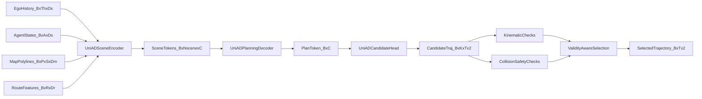

# UniAD Planning Paper-to-Code (End-to-End)

This note explains how the pure-PyTorch `planning/uniad` implementation maps paper-style planning concepts into concrete tensors, modules, and safety contracts.

## 0) Scope and Artifacts

- Model key: `planning/uniad`
- Implementation: `pytorch_implementation/planning/uniad/`
- Tests: `tests/planning/uniad.py`
- Notebook: `study/notebook/planning/uniad_paper_to_code.ipynb`
- Paper: `papers/planning/uniad.pdf`
- Reference repo: `repos/planning/uniad/`

## 1) Canonical study setup (fixed dummy run)

Use a fixed debug setup so every section refers to stable shapes.

- Config call: `debug_forward_config()` from `pytorch_implementation/planning/uniad/config.py`
- Core dimensions:
  - `history_steps = 4`
  - `future_steps = 6`
  - `num_agents = 8`
  - `map_polylines = 12`
  - `points_per_polyline = 6`
  - `hidden_dim = 64`
  - `num_candidates = 4`
  - `dt = 0.5`
- Synthetic batch from `build_debug_batch(cfg.e2e, batch_size=2)`:
  - `ego_history`: `[B, Th, Ds] = [2, 4, 6]`
  - `agent_states`: `[B, A, Ds] = [2, 8, 6]`
  - `map_polylines`: `[B, P, S, Dm] = [2, 12, 6, 2]`
  - `route_features`: `[B, R, Dr] = [2, 16, 4]`

Expected end-to-end outputs:
- `candidate_trajectories`: `[2, 4, 6, 2]`
- `candidate_scores`: `[2, 4]`
- `selected_trajectory`: `[2, 6, 2]`
- `feasible_mask`: `[2, 4]`
- `collision_free_mask`: `[2, 4]`

## 2) Symbol dictionary (paper -> code tensors)

- `H^{ego}` -> `ego_history` `[B, Th, Ds]`
- `A` -> `agent_states` `[B, A, Ds]`
- `M` -> `map_polylines` `[B, P, S, Dm]`
- `R` -> `route_features` `[B, R, Dr]`
- `S` -> `scene_tokens` `[B, 1 + A + P + R, C]`
- `Q` -> decoder query tokens `[B, num_query_tokens, C]`
- `z` -> `plan_token` `[B, C]`
- `\Delta` -> `candidate_deltas` `[B, K, T, 2]`
- `\hat{Y}` -> `candidate_trajectories` `[B, K, T, 2]`
- `\pi` -> `candidate_scores` `[B, K]`
- `k*` -> `selected_index` `[B]`
- `\mathcal{F}` -> `feasible_mask` `[B, K]`
- `\mathcal{C}` -> `collision_free_mask` `[B, K]`

Equation ID convention used below: `E<chunk>.<index>`.

---

## Chunk 0 - End-to-End Planning Contract

### Goal
Generate multimodal trajectory candidates and pick one trajectory that is score-optimal under safety and feasibility constraints.

### Paper concept/equation
Planning output is candidate-based: first decode trajectories and confidence, then apply hard constraints before final selection.

### Explicit equations
`(E0.1)` Candidate rollout from ego anchor:

\[
\hat{Y}_{b,k,1:T} = x^{ego}_{b,t_0} + \sum_{\tau=1}^{T}\Delta_{b,k,\tau}
\]

`(E0.2)` Candidate probabilities:

\[
\pi_{b,k} = \mathrm{softmax}(l_{b,k})
\]

`(E0.3)` Validity-aware selection:

\[
k^\*=\arg\max_k\ \pi_{b,k}\ \text{subject to}\ \mathcal{F}_{b,k}\land\mathcal{C}_{b,k}
\]

### Symbol table (E0.*)
- `\hat{Y}_{b,k,1:T}` -> `candidate_trajectories` `[B, K, T, 2]`
- `\Delta_{b,k,\tau}` -> `candidate_deltas` `[B, K, T, 2]`
- `l_{b,k}` -> `candidate_logits` `[B, K]`
- `\pi_{b,k}` -> `candidate_scores` `[B, K]`
- `\mathcal{F}` -> `feasible_mask`
- `\mathcal{C}` -> `collision_free_mask`
- `k*` -> `selected_index`

### Code mapping
- `UniADLite.forward` in `pytorch_implementation/planning/uniad/model.py`
- Candidate decode in `UniADCandidateHead.forward`
- Validity-aware argmax in `UniADLite._select_best`

### Key code snippet
```python
candidate_trajectories, deltas, candidate_logits = self.candidate_head(plan_token, start_xy)
candidate_scores = torch.softmax(candidate_logits, dim=-1)
selected_index = self._select_best(
    candidate_scores=candidate_scores,
    feasible_mask=feasible_mask,
    collision_free=collision_free,
)
```

### Input tensors (shape + meaning)
- `plan_token`: `[B, C]`, compact planning context.
- `start_xy`: `[B, 2]`, last observed ego center.

### Output tensors (shape + meaning)
- `candidate_trajectories`: `[B, K, T, 2]`, multimodal xy futures.
- `candidate_scores`: `[B, K]`, probability per candidate.
- `selected_trajectory`: `[B, T, 2]`, selected trajectory.

### Math intuition (plain language)
The planner first proposes a small set of futures, then allows safety/kinematic contracts to veto unsafe options before committing to one.

### One sanity check
`selected_trajectory` must equal `candidate_trajectories.gather(...)` with `selected_index`.

---

## Chunk 1 - Scene Encoding

### Goal
Fuse ego history, dynamic agents, map vectors, and route hints into shared scene tokens.

### Paper concept/equation
Scene encoding builds a tokenized world representation that downstream query decoding can attend to.

### Explicit equations
`(E1.1)` Ego summary:

\[
e_b=\mathrm{GRU}(\mathrm{MLP}(H^{ego}_b))
\]

`(E1.2)` Scene token composition:

\[
S_b=\mathrm{Concat}\big(e_b,\ \mathrm{MLP}(A_b),\ \mathrm{Pool}(\mathrm{MLP}(M_b)),\ \mathrm{MLP}(R_b)\big)
\]

### Symbol table (E1.*)
- `H^{ego}` -> `ego_history` `[B, Th, Ds]`
- `A` -> `agent_states` `[B, A, Ds]`
- `M` -> `map_polylines` `[B, P, S, Dm]`
- `R` -> `route_features` `[B, R, Dr]`
- `S` -> `scene_tokens` `[B, Nscene, C]`

### Code mapping
- `UniADSceneEncoder.forward` in `pytorch_implementation/planning/uniad/model.py`
- Projections: `ego_proj`, `agent_proj`, `map_point_proj`, `route_proj`

### Key code snippet
```python
ego_tokens = self.ego_proj(batch.ego_history)
_, ego_hidden = self.ego_gru(ego_tokens)
ego_token = ego_hidden[-1].unsqueeze(1)
agent_tokens = self.agent_proj(batch.agent_states)
map_tokens = self.map_point_proj(batch.map_polylines).mean(dim=2)
scene_tokens = self.norm(torch.cat([ego_token, agent_tokens, map_tokens, route_tokens], dim=1))
```

### Input tensors (shape + meaning)
- `ego_history [2, 4, 6]`: temporal ego state trace.
- `agent_states [2, 8, 6]`: current dynamic agent state bank.
- `map_polylines [2, 12, 6, 2]`: vectorized map context.
- `route_features [2, 16, 4]`: route hint tokens.

### Output tensors (shape + meaning)
- `scene_tokens [2, 37, 64]`: fused scene memory (`1 + 8 + 12 + 16 = 37` tokens).

### Math intuition (plain language)
Everything is embedded into one latent channel space so later attention can compare and combine ego, scene, and route cues directly.

### One sanity check
Every projected branch should end with channel dimension `hidden_dim = 64`.

---

## Chunk 2 - Query Planning Decoder

### Goal
Decode planning context from scene tokens via learnable planning queries and cross-attention.

### Paper concept/equation
Planning queries act as latent probes over scene memory; averaging the refined query bank yields a global planning token.

### Explicit equations
`(E2.1)` Query update:

\[
q^{l+1}=\mathrm{LN}\left(q^l+\mathrm{CrossAttn}(q^l,S)\right)+\mathrm{FFN}(q^l)
\]

`(E2.2)` Plan token:

\[
z=\frac{1}{N_q}\sum_{i=1}^{N_q} q^L_i
\]

### Symbol table (E2.*)
- `q^l` -> decoder query states at layer `l`
- `S` -> `scene_tokens`
- `z` -> `plan_token [B, C]`
- `N_q` -> `num_query_tokens`

### Code mapping
- `UniADPlanningDecoder.forward` in `pytorch_implementation/planning/uniad/model.py`
- Attention module: `planning_decoder.cross_attn`

### Key code snippet
```python
query = self.query_embedding.weight.unsqueeze(0).expand(batch_size, -1, -1)
for _ in range(self.layers):
    attended, _ = self.cross_attn(query=query, key=scene_tokens, value=scene_tokens, need_weights=False)
    query = self.norm1(query + attended)
    query = self.norm2(query + self.ffn(query))
plan_token = query.mean(dim=1)
```

### Input tensors (shape + meaning)
- `scene_tokens [B, Nscene, C]`
- learned query table `[Nq, C]`

### Output tensors (shape + meaning)
- `query_tokens [B, Nq, C]`
- `plan_token [B, C]`

### Math intuition (plain language)
The query bank repeatedly asks scene memory for relevant context, then condenses many local probes into one planning summary vector.

### One sanity check
Cross-attention hook output must be `[B, Nq, C]`.

---

## Chunk 3 - Kinematic Feasibility and Safety

### Goal
Apply hard physical and collision constraints to trajectory candidates before final selection.

### Paper concept/equation
A candidate is admissible only if it stays under speed/acceleration/curvature limits and preserves minimum safety distance to rolled-out agents.

### Explicit equations
`(E3.1)` Velocity and acceleration:

\[
v=\frac{\Delta x}{\Delta t},\qquad a=\frac{\Delta v}{\Delta t}
\]

`(E3.2)` Kinematic feasibility:

\[
\mathcal{F}=\mathbf{1}[\|v\|\le v_{max}]\land\mathbf{1}[\|a\|\le a_{max}]\land\mathbf{1}[\kappa\le \kappa_{max}]
\]

`(E3.3)` Collision safety:

\[
\mathcal{C}=\mathbf{1}[d_{min}(\hat{Y},\hat{A})\ge d_{safe}]
\]

### Symbol table (E3.*)
- `v` -> `velocity` `[B, K, T, 2]`
- `a` -> `acceleration` `[B, K, T, 2]`
- `\kappa` -> `curvature` `[B, K, T]`
- `d_{min}` -> `min_distance` `[B, K]`
- `d_{safe}` -> `cfg.e2e.safety_margin`
- `\mathcal{F}` -> `feasible_mask`
- `\mathcal{C}` -> `collision_free_mask`

### Code mapping
- `pytorch_implementation/planning/common/kinematics.py`
- `pytorch_implementation/planning/common/safety.py`
- Applied in `UniADLite.forward`

### Key code snippet
```python
velocity = velocity_from_trajectory(candidate_trajectories, dt=self.cfg.e2e.dt)
acceleration = acceleration_from_velocity(velocity, dt=self.cfg.e2e.dt)
curvature = curvature_from_trajectory(candidate_trajectories)
collision_free, min_distance = collision_free_mask(
    candidate_trajectories=candidate_trajectories,
    agent_states=batch.agent_states,
    safety_margin=self.cfg.e2e.safety_margin,
    dt=self.cfg.e2e.dt,
)
```

### Input tensors (shape + meaning)
- `candidate_trajectories [B, K, T, 2]`
- `agent_states [B, A, Ds]`
- contract constants (`dt`, speed/accel/curvature limits, safety margin)

### Output tensors (shape + meaning)
- `feasible_mask [B, K]`
- `collision_free_mask [B, K]`
- `safety_margin_violation [B, K]`

### Math intuition (plain language)
Scoring chooses among options, but constraints define which options are even legal to choose.

### One sanity check
`collision_free_mask` must exactly equal `(min_distance >= safety_margin)`.

---

## 3) Dataflow diagram



## 4) One end-to-end tensor trace

1. Build debug batch with `B=2`, `Th=4`, `A=8`, `P=12`, `T=6`.
2. Scene encoder produces `scene_tokens [2, 37, 64]`.
3. Planning decoder outputs `query_tokens [2, 16, 64]` and `plan_token [2, 64]`.
4. Candidate head predicts `candidate_logits [2, 4]` and `candidate_deltas [2, 4, 6, 2]`.
5. Cumulative integration yields `candidate_trajectories [2, 4, 6, 2]`.
6. Kinematics derive `velocity`, `acceleration`, and `curvature`.
7. Safety rollout computes `min_distance [2, 4]` and `collision_free_mask [2, 4]`.
8. Validity-aware selection returns `selected_index [2]`.
9. Gather operation forms `selected_trajectory [2, 6, 2]`.
10. Output dictionary returns contract keys plus debugging tensors.

## 5) Study drills (self-check questions)

1. Why is candidate integration (`cumsum`) done in delta space instead of directly regressing absolute positions?
2. Which tensors correspond to paper symbols `H^{ego}`, `S`, and `\hat{Y}`?
3. What role does `route_features` play in scene token composition?
4. Why does the selector use a fallback argmax when no candidate is valid?
5. How does `dt` affect both feasibility and safety behavior?
6. Which function computes curvature, and what does it approximate?
7. Why is `collision_free_mask` computed from rolled agent trajectories rather than static agent centers?
8. What is the difference between `candidate_logits` and `candidate_scores`?
9. Which modules are shared in `planning/common` vs model-specific in `planning/uniad`?
10. Which hook outputs are most useful if selected trajectory looks unstable?

## 6) Practical reading order for this note

1. Start with Sections 1 and 2 for setup and tensor dictionary.
2. Read Chunks 0 and 1 to understand the E2E contract and scene encoding.
3. Continue with Chunk 2 for query decoding mechanics.
4. Finish with Chunk 3 for physical/safety constraints and selection logic.
5. Re-run the notebook and verify the tensor trace in Section 4.
6. Answer study drills without code, then confirm against implementation.

## 7) Strict parity notes and pure-PyTorch replacements

- Runtime is pure PyTorch; no MMDet3D/MMCV runtime ops are required.
- Planning constraints are explicit and test-backed (`tests/planning/uniad.py`).
- Shared kernels for kinematics and safety are centralized in `pytorch_implementation/planning/common/`.
- Notebook and markdown are kept in sync via `study/notebook/_generate_notebooks.py`.
