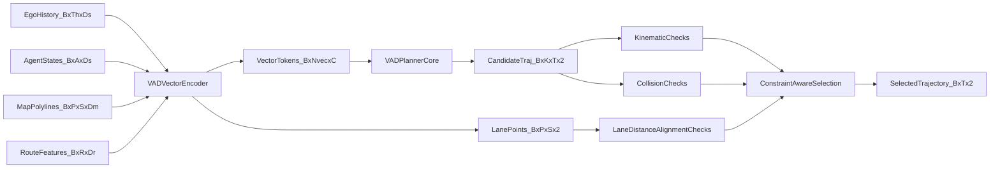

# VAD Planning Paper-to-Code (End-to-End)

This note explains the pure-PyTorch `planning/vad` implementation with an emphasis on vectorized scene reasoning and lane-aware planning constraints.

## 0) Scope and Artifacts

- Model key: `planning/vad`
- Implementation: `pytorch_implementation/planning/vad/`
- Tests: `tests/planning/vad.py`
- Notebook: `study/notebook/planning/vad_paper_to_code.ipynb`
- Paper: `papers/planning/vad.pdf`
- Reference repo: `repos/planning/vad/`

## 1) Canonical study setup (fixed dummy run)

Use one deterministic debug setup for all sections.

- Config call: `debug_forward_config()` from `pytorch_implementation/planning/vad/config.py`
- Core dimensions:
  - `history_steps = 4`
  - `future_steps = 6`
  - `num_agents = 8`
  - `map_polylines = 14`
  - `points_per_polyline = 6`
  - `hidden_dim = 64`
  - `num_candidates = 5`
  - `dt = 0.5`
- Synthetic batch from `build_debug_batch(cfg.e2e, batch_size=2)`:
  - `ego_history [2, 4, 6]`
  - `agent_states [2, 8, 6]`
  - `map_polylines [2, 14, 6, 2]`
  - `route_features [2, 16, 4]`

Expected outputs:
- `candidate_trajectories [2, 5, 6, 2]`
- `candidate_scores [2, 5]`
- `lane_distance [2, 5]`
- `lane_alignment [2, 5]`
- `constraint_cost [2, 5]`

## 2) Symbol dictionary (paper -> code tensors)

- `H^{ego}` -> `ego_history` `[B, Th, Ds]`
- `A` -> `agent_states` `[B, A, Ds]`
- `M` -> `map_polylines` `[B, P, S, Dm]`
- `Z` -> `vector_tokens` `[B, Nvec, C]`
- `q` -> ego query token `[B, 1, C]`
- `\hat{Y}` -> `candidate_trajectories` `[B, K, T, 2]`
- `\pi` -> `candidate_scores` `[B, K]`
- `d_{lane}` -> `lane_distance` `[B, K]`
- `\cos\theta` -> `lane_alignment` `[B, K]`
- `J` -> `constraint_cost` `[B, K]`
- `\mathcal{F}_{final}` -> `feasible_mask` `[B, K]`

Equation ID convention used below: `E<chunk>.<index>`.

---

## Chunk 0 - End-to-End Contract

### Goal
Produce lane-aware, collision-aware candidate trajectories and select one valid trajectory.

### Paper concept/equation
The planner combines trajectory likelihood with explicit geometric penalties (collision margin, lane distance, lane alignment).

### Explicit equations
`(E0.1)` Candidate rollout:

\[
\hat{Y}_{b,k,1:T}=x^{ego}_{b,t_0}+\sum_{\tau=1}^{T}\Delta_{b,k,\tau}
\]

`(E0.2)` Constraint cost:

\[
J_{b,k}=w_c\cdot\max(0,d_{safe}-d_{min}) + w_b\cdot d_{lane} + w_a\cdot\max(0,1-\cos\theta)
\]

`(E0.3)` Selection over valid set:

\[
k^\*=\arg\max_k\ \pi_{b,k}\ \text{subject to}\ \mathcal{F}_{final}(b,k)
\]

### Symbol table (E0.*)
- `\Delta` -> `candidate_deltas`
- `\hat{Y}` -> `candidate_trajectories`
- `\pi` -> `candidate_scores`
- `J` -> `constraint_cost`
- `k*` -> `selected_index`
- `\mathcal{F}_{final}` -> `feasible_mask`

### Code mapping
- `VADLite.forward` in `pytorch_implementation/planning/vad/model.py`
- Vectorized planner in `VADPlannerCore.forward`

### Key code snippet
```python
candidate_trajectories, deltas, candidate_logits = self.planner_core(vector_tokens, start_xy)
candidate_scores = torch.softmax(candidate_logits, dim=-1)
constraint_cost = (
    self.cfg.collision_weight * safety_margin_violation
    + self.cfg.boundary_weight * lane_distance
    + self.cfg.lane_align_weight * torch.relu(1.0 - lane_alignment)
)
```

### Input tensors (shape + meaning)
- `vector_tokens [B, Nvec, C]`: fused vectorized scene context.
- `start_xy [B, 2]`: ego start center.

### Output tensors (shape + meaning)
- `candidate_trajectories [B, K, T, 2]`
- `constraint_cost [B, K]`
- `selected_trajectory [B, T, 2]`

### Math intuition (plain language)
The model does not rely on score alone; it injects vectorized scene geometry into both feasibility masking and differentiable-ish cost diagnostics.

### One sanity check
If lane distance and collision margin worsen, `constraint_cost` should increase.

---

## Chunk 1 - Vector Scene Encoding

### Goal
Transform ego, agents, map, and route vectors into a shared token bank.

### Paper concept/equation
Vectorized planning treats lanes and agents as structured vectors rather than dense image-grid features.

### Explicit equations
`(E1.1)` Vector tokenization:

\[
z^{ego}=\mathrm{MLP}(x^{ego}_{t_0}),\quad
z^{agent}=\mathrm{MLP}(A),\quad
z^{map}=\mathrm{Pool}(\mathrm{MLP}(M))
\]

`(E1.2)` Token fusion:

\[
Z=\mathrm{Concat}(z^{ego},z^{agent},z^{map},z^{route})
\]

### Symbol table (E1.*)
- `x^{ego}_{t_0}` -> `ego_history[:, -1]`
- `A` -> `agent_states`
- `M` -> `map_polylines`
- `Z` -> `vector_tokens`

### Code mapping
- `VADVectorEncoder.forward` in `pytorch_implementation/planning/vad/model.py`
- Lane points extraction from `batch.map_polylines[..., :2]`

### Key code snippet
```python
ego_token = self.ego_proj(batch.ego_history[:, -1]).unsqueeze(1)
agent_tokens = self.agent_proj(batch.agent_states)
map_tokens = self.map_point_proj(batch.map_polylines).mean(dim=2)
tokens = self.norm(torch.cat(vector_tokens, dim=1))
lane_points = batch.map_polylines[..., :2]
```

### Input tensors (shape + meaning)
- `ego_history [2, 4, 6]`
- `agent_states [2, 8, 6]`
- `map_polylines [2, 14, 6, 2]`
- `route_features [2, 16, 4]`

### Output tensors (shape + meaning)
- `vector_tokens [2, 39, 64]` (`1 + 8 + 14 + 16 = 39`)
- `lane_points [2, 14, 6, 2]`

### Math intuition (plain language)
VAD builds a compact vector memory where lane geometry and dynamic objects become first-class tokens for planning.

### One sanity check
All projected token branches must end in `hidden_dim = 64`.

---

## Chunk 2 - Vectorized Planning Core

### Goal
Refine ego query against vector token memory and decode candidate trajectories.

### Paper concept/equation
Ego planning query repeatedly cross-attends to vector tokens, then decodes multimodal trajectory deltas and logits.

### Explicit equations
`(E2.1)` Ego query refinement:

\[
q^{l+1}=\mathrm{LN}(q^l+\mathrm{CrossAttn}(q^l,Z)+\mathrm{FFN}(q^l))
\]

`(E2.2)` Candidate decode:

\[
\Delta,l = f(q^L),\qquad
\hat{Y}=x^{ego}_{t_0}+\mathrm{cumsum}(\Delta)
\]

### Symbol table (E2.*)
- `q^l` -> ego query at layer `l`
- `Z` -> `vector_tokens`
- `\Delta` -> `candidate_deltas`
- `l` -> `candidate_logits`

### Code mapping
- `VADPlannerCore.forward` in `pytorch_implementation/planning/vad/model.py`
- `cross_attn`, `traj_head`, `score_head`

### Key code snippet
```python
ego_query = vector_tokens[:, :1, :]
for layer in self.layers:
    attended, _ = self.cross_attn(query=fused, key=vector_tokens, value=vector_tokens, need_weights=False)
    fused = self.norm(fused + attended + layer(fused))
raw_deltas = self.traj_head(fused).view(batch_size, K, T, 2)
```

### Input tensors (shape + meaning)
- `vector_tokens [B, Nvec, C]`
- `start_xy [B, 2]`

### Output tensors (shape + meaning)
- `candidate_trajectories [B, K, T, 2]`
- `candidate_scores [B, K]`

### Math intuition (plain language)
The ego query distills vector context into one planning latent, then expands it into multimodal trajectories and confidence.

### One sanity check
`candidate_scores.sum(-1)` should be approximately one for each batch item.

---

## Chunk 3 - Vectorized Constraint Checks

### Goal
Compose kinematic, collision, lane-distance, and lane-direction constraints into final feasibility.

### Paper concept/equation
Vectorized lane geometry allows explicit lane distance and direction checks in addition to generic kinematic and collision rules.

### Explicit equations
`(E3.1)` Collision constraint:

\[
\mathcal{C}_{coll}=\mathbf{1}[d_{min}(\hat{Y},\hat{A})\ge d_{safe}]
\]

`(E3.2)` Lane constraints:

\[
\mathcal{C}_{lane}=\mathbf{1}[d_{lane}\le d_{tol}],\qquad
\mathcal{C}_{align}=\mathbf{1}[\cos\theta\ge 0]
\]

`(E3.3)` Final feasible set:

\[
\mathcal{F}_{final}=\mathcal{F}_{kin}\land\mathcal{C}_{coll}\land\mathcal{C}_{lane}\land\mathcal{C}_{align}
\]

### Symbol table (E3.*)
- `d_{min}` -> `min_distance`
- `d_{lane}` -> `lane_distance`
- `\cos\theta` -> `lane_alignment`
- `\mathcal{F}_{kin}` -> base kinematic feasibility
- `\mathcal{F}_{final}` -> `feasible_mask`

### Code mapping
- Constraint composition in `VADLite.forward`
- Shared kernels in `pytorch_implementation/planning/common/{kinematics.py,safety.py}`

### Key code snippet
```python
lane_mask = lane_distance <= lane_tolerance
lane_align_mask = lane_alignment >= 0.0
valid = feasible_mask & collision_free & lane_mask & lane_align_mask
safe_scores = candidate_scores.masked_fill(~valid, -1.0)
```

### Input tensors (shape + meaning)
- `candidate_trajectories [B, K, T, 2]`
- `lane_points [B, P, S, 2]`
- `agent_states [B, A, Ds]`

### Output tensors (shape + meaning)
- `feasible_mask [B, K]`
- `lane_distance [B, K]`
- `lane_alignment [B, K]`
- `constraint_cost [B, K]`

### Math intuition (plain language)
Lane geometry is not just context; it is explicitly enforced in feasibility and scored as a diagnostic cost.

### One sanity check
Every `True` in `feasible_mask` must also satisfy lane-distance and lane-alignment masks.

---

## 3) Dataflow diagram



## 4) One end-to-end tensor trace

1. Build debug inputs with `B=2`, `Th=4`, `A=8`, `P=14`, `K=5`, `T=6`.
2. Vector encoder emits `vector_tokens [2, 39, 64]` and `lane_points [2, 14, 6, 2]`.
3. Planner core updates ego query via cross-attention over `vector_tokens`.
4. Decoder heads output `candidate_logits [2, 5]` and `candidate_deltas [2, 5, 6, 2]`.
5. Integrate deltas into `candidate_trajectories [2, 5, 6, 2]`.
6. Compute `velocity`, `acceleration`, and `curvature`.
7. Compute agent-distance safety: `min_distance [2, 5]`.
8. Compute `lane_distance [2, 5]` and `lane_alignment [2, 5]`.
9. Combine constraints into `feasible_mask [2, 5]`.
10. Gather selected candidate into `selected_trajectory [2, 6, 2]`.

## 5) Study drills (self-check questions)

1. Why does VAD use vector tokens instead of dense raster BEV tensors in this implementation?
2. Which function turns map polylines into lane-distance constraints?
3. How is lane direction computed, and why normalize it?
4. What is the relationship between `feasible_mask` and `constraint_cost`?
5. Why is collision-free checked before selection rather than after?
6. Which tensors capture lane geometry in the forward output dict?
7. How does `num_candidates` affect decode heads and output shapes?
8. Why is there a fallback selection path when no candidate is valid?
9. Where are kinematic limits configured and how are they enforced?
10. If lane alignment is negative, what behavior should selection show?

## 6) Practical reading order for this note

1. Read Sections 1 and 2 to fix shapes and notation.
2. Study Chunk 1 first to understand vector token construction.
3. Study Chunk 2 for the planning decode mechanism.
4. Study Chunk 3 for explicit geometric constraints.
5. Return to Chunk 0 to connect scoring, costs, and selection.
6. Validate your understanding with Section 4 trace and Section 5 drills.

## 7) Strict parity notes and pure-PyTorch replacements

- Runtime remains pure PyTorch and avoids MMDet3D/MMCV dependencies.
- Lane and safety constraints are explicit and covered by `tests/planning/vad.py`.
- Shared planning kernels live in `pytorch_implementation/planning/common/`.
- Notebook derives directly from markdown through `study/notebook/_generate_notebooks.py` to keep artifacts synchronized.
