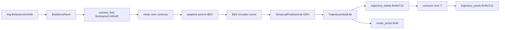

# BEVerse Paper-to-Code Study Guide (Prediction)

This note maps BEVerse-style prediction concepts to the pure-PyTorch strict-parity implementation in this repository.

Primary references:
- Paper: [BEVerse: Unified Perception and Prediction in Bird's-Eye View for Vision-Centric Autonomous Driving](https://arxiv.org/abs/2205.09743)
- Reference lineage: [https://github.com/zhangyp15/BEVerse](https://github.com/zhangyp15/BEVerse)
- Pure-PyTorch implementation: `pytorch_implementation/prediction/beverse/`
- Intermediate tensor tests: `tests/prediction/beverse.py`

## 1) Canonical study setup (fixed debug run)

- Config:
  - `debug_forward_config(num_cams=4, embed_dims=96, bev_h=12, bev_w=12, pred_horizon=8, num_modes=3)`
- Input image:
  - `img`: `[B, Ncam, C, H, W] = [2, 4, 3, 96, 160]`
- Metadata:
  - `img_metas`: optional list of sample dictionaries (kept for API parity)

Core dimensions:
- `embed_dims = 96`
- `bev = [Hbev, Wbev] = [12, 12]`
- `pred_horizon = 8`
- `num_modes = 3`
- `future_dt = 0.5 s`

Expected outputs:
- `trajectory_deltas`: `[B, M, T, 2] = [2, 3, 8, 2]`
- `trajectory_preds`: `[B, M, T, 2] = [2, 3, 8, 2]`
- `mode_logits`: `[B, M] = [2, 3]`
- `time_stamps`: `[T] = [8]`

## 2) Symbol dictionary (paper -> code tensors)

- `I_t` (multi-camera image) -> `img` in `BEVerseLite.forward`
- `F_t` (image feature map) -> `camera_feat` from `extract_img_feat`
- `B_t` (BEV tensor) -> `bev_embed`
- `q_t^k` (temporal query token at step `k`) -> `temporal_tokens[:, k]`
- `\Delta p_t^{m,k}` (per-mode displacement) -> `trajectory_deltas[:, m, k]`
- `p_t^{m,k}` (future trajectory point) -> `trajectory_preds[:, m, k]`
- `\pi_t^m` (mode score/probability) -> `mode_logits[:, m]`, `mode_probs[:, m]`
- `\Delta t` (time step) -> `cfg.future_dt`, `time_stamps`

Equation IDs use `E<section>.<index>`.

---

## Chunk 0 - End-to-end forward contract

### Goal
Bind a BEVerse-style prediction path to concrete module calls and tensor outputs.

### Explicit equations
`(E0.1)` Feature and BEV construction:

$$
F_t = \mathrm{CamEncoder}(I_t), \quad
B_t = \mathrm{BEVEncoder}(\mathrm{FuseCam}(F_t))
$$

`(E0.2)` Temporal decoding and multimodal forecasting:

$$
Q_t = \mathrm{TemporalDecoder}(B_t), \quad
\Delta P_t = \mathrm{Head}_{\Delta}(Q_t), \quad
P_t = \mathrm{cumsum}(\Delta P_t)
$$

### Code mapping
- `BEVerseLite.forward` in `pytorch_implementation/prediction/beverse/model.py`
- `TemporalPredictorLite.forward` in `pytorch_implementation/prediction/beverse/temporal.py`
- `TrajectoryHeadLite.forward` in `pytorch_implementation/prediction/beverse/head.py`

### One sanity check
`tests/prediction/beverse.py` verifies full output shapes under debug config.

---

## Chunk 1 - Multi-camera image encoding and BEV seed

### Goal
Map camera-view CNN features into a compact BEV tensor used by the predictor.

### Explicit equations
`(E1.1)` Camera aggregation:

$$
\bar{F}_t = \frac{1}{N_{cam}}\sum_{c=1}^{N_{cam}} F_t^{(c)}
$$

`(E1.2)` BEV seed resize:

$$
B_t^{seed} = \mathrm{Pool}_{H_{bev},W_{bev}}(\bar{F}_t)
$$

### Code mapping
- `BackboneNeck` in `pytorch_implementation/prediction/beverse/backbone_neck.py`
- camera averaging + adaptive pooling in `BEVerseLite.forward`

### Tensor shape notes
- `camera_feat`: `[B, Ncam, C, Hf, Wf]`
- `bev_seed`: `[B, C, Hbev, Wbev]`
- `bev_embed`: `[B, C, Hbev, Wbev]`

### One sanity check
Tests assert backbone/FPN capture shapes and BEV encoder intermediate shapes.

---

## Chunk 2 - Temporal horizon decoding

### Goal
Connect fixed-horizon temporal tokens to the BEV context.

### Explicit equations
`(E2.1)` BEV context pooling:

$$
h_0 = \tanh(W_h \cdot \mathrm{GAP}(B_t))
$$

`(E2.2)` Horizon token decoding:

$$
Q_t = \mathrm{GRU}(E_{time}(1:T), h_0)
$$

### Code mapping
- `TemporalPredictorLite` in `pytorch_implementation/prediction/beverse/temporal.py`

### Tensor shape notes
- `time_embedding`: `[B, T, C]`
- `temporal_tokens`: `[B, T, C]`

### One sanity check
Tests assert `temporal.gru` output shape and finite values.

---

## Chunk 3 - Multimodal trajectory and mode heads

### Goal
Map temporal tokens to per-mode XY displacements and mode probabilities.

### Explicit equations
`(E3.1)` Displacement prediction:

$$
\Delta p_t^{m,k} = \tanh\left(W_{\Delta} q_t^k\right)\cdot s_{\max}
$$

`(E3.2)` Trajectory integration:

$$
p_t^{m,k} = \sum_{j=1}^{k}\Delta p_t^{m,j}
$$

`(E3.3)` Mode probabilities:

$$
\pi_t = \mathrm{softmax}(W_{\pi} q_t^T)
$$

### Code mapping
- `TrajectoryHeadLite.forward` in `pytorch_implementation/prediction/beverse/head.py`
- best-mode decode in `BEVerseLite._decode_prediction`

### One sanity check
Tests verify `trajectory_preds == cumsum(trajectory_deltas)` exactly (within tolerance).

---

## Chunk 4 - Prediction metrics and horizon integrity

### Goal
Connect trajectory outputs to ADE/FDE and temporal-axis correctness checks.

### Explicit equations
`(E4.1)` ADE:

$$
\mathrm{ADE} = \frac{1}{T_v}\sum_{k=1}^{T} m_k \| \hat{p}_k - p_k \|_2
$$

`(E4.2)` FDE:

$$
\mathrm{FDE} = \| \hat{p}_{k^*} - p_{k^*} \|_2,\quad k^*=\max\{k \mid m_k=1\}
$$

### Code mapping
- `compute_ade_fde` and `select_best_mode_by_ade` in `pytorch_implementation/prediction/beverse/metrics.py`
- metric smoke test in `tests/prediction/beverse.py`

### One sanity check
Tests assert ADE/FDE are finite/non-negative and `time_stamps` increments by `future_dt`.

---

## 3) Dataflow diagram

## 4) One end-to-end tensor trace

1. Input `img [2, 4, 3, 96, 160]`.
2. Backbone+FPN returns one level, reshaped to `camera_feat [2, 4, 96, 6, 10]`.
3. Camera-average + pooling produce `bev_seed [2, 96, 12, 12]`.
4. BEV encoder outputs `bev_embed [2, 96, 12, 12]`.
5. Temporal GRU decodes `temporal_tokens [2, 8, 96]`.
6. Head predicts:
   - `trajectory_deltas [2, 3, 8, 2]`
   - `trajectory_preds [2, 3, 8, 2]`
   - `mode_probs [2, 3]`.
7. Decode picks argmax mode:
   - `best_trajectory [2, 8, 2]`.

## 5) Study drills (self-check questions)

1. Why does this implementation predict displacements (`\Delta p`) before cumulative positions (`p`)?
2. Which tensor corresponds to paper symbol `q_t^k`?
3. Which axis in `trajectory_preds` is time, and how is it validated?
4. Why use a learned time embedding before GRU decoding?
5. How do ADE/FDE differ when masks hide the final step?

## 6) Practical reading order

1. Read Chunk 0 for the overall contract.
2. Read Chunk 1 to map image features into BEV.
3. Read Chunk 2 and Chunk 3 for temporal decoding and multimodal outputs.
4. Read Chunk 4 and then inspect `tests/prediction/beverse.py`.

## 7) Strict parity notes and pure-PyTorch replacements

- Behavioral parity is pinned to frozen BEVerse anchors in `study/markdown/strict_parity_anchor_manifest.md`.
- Multi-task contract (`map`, `3dod`, `motion`) is preserved with strict task-output ordering and motion decode semantics.
- Temporal neck behavior keeps sequence validity and time-index contracts, including monotonic horizon checks.
- Framework/runtime dependencies are replaced with pure PyTorch modules while preserving trajectory mode semantics.
