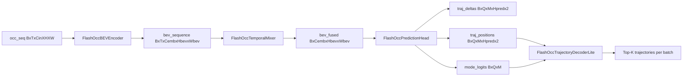

# FlashOcc (Prediction) Paper-to-Code Study Guide

This note maps FlashOcc-inspired occupancy reasoning to a pure-PyTorch trajectory prediction stack.

Primary references:
- Paper: [FlashOcc: Fast and Memory-Efficient Occupancy Prediction via Channel-to-Height Plugin](https://arxiv.org/abs/2311.12058)
- Reference implementation: [Yzichen/FlashOCC](https://github.com/Yzichen/FlashOCC)
- Pure-PyTorch implementation: `pytorch_implementation/prediction/flashocc/`
- Intermediate tensor tests: `tests/prediction/flashocc.py`

## 1) Canonical study setup (fixed debug run)

Use one compact setup so all equation-to-tensor mappings remain stable.

- Config:
  - `debug_forward_config(num_history=4, pred_horizon=8, bev_h=48, bev_w=64, num_queries=12, num_modes=3, topk=6)`
- Input occupancy sequence:
  - `occ_seq`: `[B, T, Cin, H, W] = [2, 4, 4, 48, 64]`
- Core dimensions:
  - `embed_dims = 96`
  - `num_queries = 12`
  - `num_modes = 3`
  - `pred_horizon = 8`
  - `dt = 0.5 s`

Expected key outputs:
- `traj_positions`: `[B, Q, M, Hpred, 2] = [2, 12, 3, 8, 2]`
- `mode_logits`: `[B, Q, M] = [2, 12, 3]`
- `time_stamps`: `[Hpred] = [8]`

These are validated in `tests/prediction/flashocc.py`.

## 2) Symbol dictionary (paper -> code tensors)

- `O_t` (occupancy evidence over time) -> `occ_seq` in `FlashOccLite.forward`
- `E_t` (encoded BEV feature) -> `bev_sequence[:, t]` in `FlashOccBEVEncoder.forward`
- `\tilde{E}` (temporally fused BEV) -> `bev_fused` in `FlashOccTemporalMixer.forward`
- `q_i` (agent query token) -> `query_tokens[:, i]` in `FlashOccPredictionHead.forward`
- `\Delta p_{i,m,\tau}` (future displacement) -> `traj_deltas[:, i, m, \tau]`
- `p_{i,m,\tau}` (future position) -> `traj_positions[:, i, m, \tau]`
- `\pi_{i,m}` (mode confidence) -> `mode_logits[:, i, m]`

Equation IDs are stable as `E<section>.<index>`.

---

## Chunk 0 - End-to-end prediction contract

### Goal
Bind the full occupancy-to-trajectory pathway to concrete model calls.

### Paper concept/equation
Occupancy history is encoded, temporally fused, queried with agent tokens, and decoded into multi-modal trajectories.

### Explicit equations
`(E0.1)` BEV encoding and fusion:

$$
E_{1:T} = \mathrm{BEVEncoder}(O_{1:T}), \quad
\tilde{E} = \mathrm{TemporalFuse}(E_{1:T})
$$

`(E0.2)` Query-based trajectory prediction:

$$
Q = \mathrm{CrossAttn}(Q_0, \tilde{E}),\quad
\Delta P = f_{\Delta}(Q),\quad
\Pi = f_{\pi}(Q)
$$

`(E0.3)` Cumulative trajectory integration:

$$
P_{i,m,\tau} = p^0_i + \sum_{k=1}^{\tau} \Delta p_{i,m,k}
$$

### Symbol table (E0.*)
- `Q_0`: learned query embeddings
- `P`: decoded trajectories in XY metric plane
- `\Pi`: mode logits per query

### Code mapping
- `FlashOccLite.forward` in `pytorch_implementation/prediction/flashocc/model.py`
- `FlashOccBEVEncoder` in `pytorch_implementation/prediction/flashocc/backbone.py`
- `FlashOccTemporalMixer` in `pytorch_implementation/prediction/flashocc/temporal.py`
- `FlashOccPredictionHead` in `pytorch_implementation/prediction/flashocc/head.py`
- `FlashOccTrajectoryDecoderLite` in `pytorch_implementation/prediction/flashocc/postprocess.py`

### Tensor shape notes
- Input `occ_seq`: `[B, T, Cin, H, W]`
- Output `traj_positions`: `[B, Q, M, Hpred, 2]`
- Output `mode_logits`: `[B, Q, M]`

### One sanity check
`tests/prediction/flashocc.py` checks output shapes, decode contract, and finite values.

---

## Chunk 1 - Occupancy encoding and channel-efficient BEV lifting

### Goal
Map occupancy channels into compact BEV embeddings.

### Paper concept/equation
FlashOcc emphasizes efficient channel-space transformations before 3D lifting; this predictor keeps that design spirit by using a lightweight BEV encoder.

### Explicit equations
`(E1.1)` Per-frame BEV embedding:

$$
E_t = \phi_{\text{stem}}(O_t)
$$

`(E1.2)` Residual BEV refinement:

$$
E_t' = \phi_{\text{res}}(E_t) + E_t
$$

### Symbol table (E1.*)
- `\phi_{\text{stem}}`: strided conv + norm + activation
- `\phi_{\text{res}}`: residual conv blocks

### Code mapping
- `FlashOccBEVEncoder.stem` and `FlashOccBEVEncoder.blocks` in `backbone.py`

### Tensor shape notes
- `backbone.stem`: `[B*T, Cemb, H/2, W/2]`
- `backbone.block*`: same shape as stem output
- `bev_sequence`: `[B, T, Cemb, H/2, W/2]`

### One sanity check
Tests assert stem/block tensor dimensions and finite values.

---

## Chunk 2 - Temporal fusion and time-axis integrity

### Goal
Connect sequence modeling to horizon-aware outputs.

### Paper concept/equation
History BEV tokens are mixed along the time axis, then projected to a fused current BEV map used for forecasting.

### Explicit equations
`(E2.1)` Temporal token mixing:

$$
z_{x,y} = \mathrm{Conv1D}_t(E_{1:T}(x,y))
$$

`(E2.2)` Fused BEV map:

$$
\tilde{E}(x,y) = \psi(z_{x,y,T})
$$

### Symbol table (E2.*)
- `z_{x,y}`: temporal token sequence per BEV cell
- `\psi`: pointwise projection conv

### Code mapping
- `FlashOccTemporalMixer.temporal_conv` and `FlashOccTemporalMixer.proj` in `temporal.py`

### Tensor shape notes
- `temporal_tokens`: `[B*Hbev*Wbev, Cemb, T]`
- `bev_fused`: `[B, Cemb, Hbev, Wbev]`
- `time_stamps`: `[Hpred]`

### One sanity check
Tests verify strictly increasing `time_stamps` and expected `dt` spacing.

---

## Chunk 3 - Query-conditioned multi-modal trajectory head

### Goal
Map fused BEV memory to per-agent multi-modal futures.

### Paper concept/equation
Learned query tokens attend to BEV memory and emit anchor, displacement, and mode logits.

### Explicit equations
`(E3.1)` Cross-attention update:

$$
Q = \mathrm{MHA}(Q_0 + g(\bar{E}), \tilde{E})
$$

`(E3.2)` Multi-modal displacement and mode logits:

$$
\Delta P = f_{\Delta}(Q), \quad \Pi = f_{\pi}(Q)
$$

### Symbol table (E3.*)
- `Q_0`: learned query parameters
- `g(\bar{E})`: pooled BEV context projection
- `f_{\Delta}`, `f_{\pi}`: linear prediction heads

### Code mapping
- `FlashOccPredictionHead.query_proj`
- `FlashOccPredictionHead.cross_attn`
- `FlashOccPredictionHead.traj_head`
- `FlashOccPredictionHead.mode_head`

### Tensor shape notes
- `query_tokens`: `[B, Q, Cemb]`
- `traj_deltas`: `[B, Q, M, Hpred, 2]`
- `mode_logits`: `[B, Q, M]`

### One sanity check
Tests assert all intermediate head captures have expected dimensions.

---

## Chunk 4 - Decode, consistency, and metric smoke checks

### Goal
Verify prediction postprocess and basic trajectory quality contracts.

### Paper concept/equation
Best mode per query is selected, top-k queries are retained, and trajectory metrics provide smoke-level quality checks.

### Explicit equations
`(E4.1)` Cumulative integration:

$$
P = p^0 + \mathrm{cumsum}(\Delta P, \tau)
$$

`(E4.2)` Mode and query selection:

$$
m_i^* = \arg\max_m \sigma(\pi_{i,m}), \quad
\mathcal{I}_{topk} = \mathrm{TopK}_i(\max_m \sigma(\pi_{i,m}))
$$

`(E4.3)` Metric smoke:

$$
\mathrm{ADE} = \frac{1}{N H}\sum \lVert P - P^{gt}\rVert_2,\quad
\mathrm{FDE} = \frac{1}{N}\sum \lVert P_H - P_H^{gt}\rVert_2
$$

### Symbol table (E4.*)
- `m_i^*`: winning mode for query `i`
- `\mathcal{I}_{topk}`: selected query indices

### Code mapping
- `FlashOccTrajectoryDecoderLite.decode` in `postprocess.py`
- `average_displacement_error`, `final_displacement_error`, `trajectory_smoothness_l2` in `metrics.py`
- Contract checks in `tests/prediction/flashocc.py`

### Tensor shape notes
- Decoded trajectories: `[K, Hpred, 2]`, `K <= topk`
- Scores/mode/query indices: `[K]`

### One sanity check
Tests verify cumulative consistency, decode schema, and ADE/FDE/smoothness finite non-negative outputs.

---

## 3) Dataflow diagram

## 4) One end-to-end tensor trace

1. Input `occ_seq = [2, 4, 4, 48, 64]`.
2. Stem/downsample -> `[8, 96, 24, 32]`.
3. Residual blocks keep shape `[8, 96, 24, 32]`.
4. Reshape sequence -> `bev_sequence = [2, 4, 96, 24, 32]`.
5. Temporal conv tokens -> `temporal_tokens = [1536, 96, 4]`.
6. Projection -> `bev_fused = [2, 96, 24, 32]`.
7. Query cross-attn -> `query_tokens = [2, 12, 96]`.
8. Trajectory heads:
   - `traj_deltas = [2, 12, 3, 8, 2]`
   - `traj_positions = [2, 12, 3, 8, 2]`
   - `mode_logits = [2, 12, 3]`.
9. Decoder returns top-k trajectories per batch (up to 6 queries).

## 5) Study drills (self-check questions)

1. Why is a temporal Conv1D enough for this debug predictor instead of a full transformer?
2. Which tensors enforce horizon integrity and `dt` spacing?
3. Why do we predict displacements (`traj_deltas`) and then integrate with cumsum?
4. How does `mode_logits` affect decode-time query selection?
5. Which checks guarantee trajectory consistency in tests?
6. What does `trajectory_smoothness_l2` measure in geometric terms?

## 6) Practical reading order for this note

1. Read Sections 1-2 for fixed dimensions and symbol names.
2. Study Chunk 1 (occupancy encoding).
3. Study Chunk 2 (temporal fusion and time-axis contract).
4. Study Chunk 3 (query attention and output heads).
5. Study Chunk 4 (decode + metrics).
6. Validate understanding using the tensor trace and drills.

## 7) Known implementation simplifications in this repo

- The model is prediction-focused and uses occupancy as direct input (no camera/lidar raw pipeline).
- Temporal fusion is Conv1D-based for speed; no explicit ego-motion warping.
- Trajectory decode is top-k query selection without map constraints.
- Metrics are smoke-level ADE/FDE/smoothness checks, not full benchmark evaluation.

These choices keep the model compact and testable while preserving key prediction contracts.

