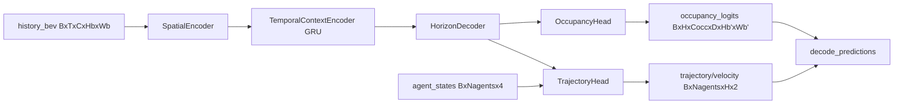

# prediction/surroundocc Paper-to-Code Study Guide

This note maps key SurroundOcc ideas to the pure-PyTorch prediction implementation in this repository.

Primary references:
- Paper (ICCV 2023): [SurroundOcc: Multi-Camera 3D Occupancy Prediction for Autonomous Driving](https://openaccess.thecvf.com/content/ICCV2023/html/Wei_SurroundOcc_Multi-camera_3D_Occupancy_Prediction_for_Autonomous_Driving_ICCV_2023_paper.html)
- Reference repo: [weiyithu/SurroundOcc](https://github.com/weiyithu/SurroundOcc)
- Implementation: `pytorch_implementation/prediction/surroundocc/`
- Tests: `tests/prediction/surroundocc.py`

## 1) Canonical debug setup

- Config: `debug_forward_config(history_steps=4, future_steps=5, num_agents=6, in_channels=16, embed_dims=64, bev_hw=(24, 24), depth_bins=4)`
- Inputs:
  - `history_bev`: `[B, T, C, Hb, Wb] = [2, 4, 16, 24, 24]`
  - `agent_states`: `[B, Nagents, 4] = [2, 6, 4]` with `(x, y, vx, vy)`
- Core outputs:
  - `occupancy_logits`: `[B, H, Cocc, D, Hb', Wb']`
  - `trajectory`: `[B, Nagents, H, 2]`
  - `velocity`: `[B, Nagents, H, 2]`

`H` is prediction horizon (`future_steps`), and `D` is depth bins (`depth_bins`).

---

## Chunk 0 - End-to-end prediction contract

### Goal
Define the full prediction contract from temporal BEV history to occupancy and trajectory forecasts.

### Paper concept/equation
`(E0.1)` Occupancy forecasting abstraction:

$$
\hat{\mathcal{O}}_{t+1:t+H} = f_{\theta}(\mathcal{F}_{t-T+1:t})
$$

`(E0.2)` Joint trajectory forecasting:

$$
\hat{\mathbf{p}}_{a,1:H} = g_{\phi}(\mathbf{s}_{a,t}, \mathbf{z}_{1:H})
$$

### Symbol table
- `\mathcal{F}_{t-T+1:t}`: temporal BEV feature history (`history_bev`)
- `\hat{\mathcal{O}}_{t+1:t+H}`: predicted occupancy logits (`occupancy_logits`)
- `\mathbf{s}_{a,t}`: current agent state (`agent_states[a]`)
- `\mathbf{z}_{1:H}`: horizon-conditioned latent tokens (`horizon_tokens`)

### Code mapping
- `SurroundOccPredictionLite.forward` in `pytorch_implementation/prediction/surroundocc/model.py`

### Tensor shape notes
- Occupancy and trajectory heads share temporal context but emit task-specific outputs.
- Output horizon axis is explicit and always equal to `cfg.future_steps`.

### One sanity check
`tests/prediction/surroundocc.py` checks output horizon/time-axis integrity and decode contract.

---

## Chunk 1 - Spatial BEV encoding and temporal context

### Goal
Map temporal BEV history into compact context vectors used by all future steps.

### Paper concept/equation
`(E1.1)` Spatial encoding per frame:

$$
\mathbf{e}_\tau = \mathrm{Enc}_{spatial}(\mathbf{F}_\tau), \quad \tau \in [t-T+1, t]
$$

`(E1.2)` Temporal aggregation:

$$
\mathbf{c}_t = \mathrm{GRU}([\mathbf{e}_{t-T+1}, \dots, \mathbf{e}_{t}])_{last}
$$

### Symbol table
- `\mathbf{F}_\tau`: BEV feature map at one history step
- `\mathbf{e}_\tau`: pooled embedding per step (`temporal_tokens`)
- `\mathbf{c}_t`: final temporal context (`temporal_context`)

### Code mapping
- `SpatialEncoder` in `model.py`
- `TemporalContextEncoder` in `model.py`

### Tensor shape notes
- `SpatialEncoder` downsamples `Hb, Wb` by 4x via two stride-2 conv blocks.
- GRU output shape is `[B, T, C]`, with final context `[B, C]`.

### One sanity check
Hooks validate `spatial.stem/block1/block2/out_proj` and `temporal.gru` shapes.

---

## Chunk 2 - Horizon decoder and occupancy logits

### Goal
Create horizon-specific BEV features and decode them into voxel occupancy logits.

### Paper concept/equation
`(E2.1)` Horizon conditioning:

$$
\mathbf{z}_h = \mathrm{MLP}(\mathbf{c}_t + \mathbf{e}^{hor}_h), \quad h=1,\dots,H
$$

`(E2.2)` Occupancy logits:

$$
\hat{\mathcal{O}}_h = \mathrm{Head}_{occ}(\mathbf{E}_t + \mathbf{z}_h)
$$

### Symbol table
- `\mathbf{e}^{hor}_h`: learned horizon embedding (`horizon_embedding[h]`)
- `\mathbf{z}_h`: horizon token (`horizon_tokens[:, h]`)
- `\mathbf{E}_t`: latest spatial BEV embedding (`spatial_features[:, -1]`)
- `\hat{\mathcal{O}}_h`: occupancy logits at horizon `h`

### Code mapping
- `HorizonDecoder` in `model.py`
- `OccupancyHead` in `model.py`

### Tensor shape notes
- `horizon_tokens`: `[B, H, C]`
- `occupancy_logits`: `[B, H, Cocc, D, Hb', Wb']`

### One sanity check
Tests assert hook captures for `horizon.mlp`, `occupancy.refine`, and `occupancy.classifier`.

---

## Chunk 3 - Trajectory forecasting and consistency

### Goal
Forecast agent trajectories while preserving a velocity/displacement consistency contract.

### Paper concept/equation
`(E3.1)` Agent-horizon fusion:

$$
\Delta \mathbf{v}_{a,h} = f_{traj}(\mathbf{u}_a + \mathbf{z}_h)
$$

`(E3.2)` Velocity recurrence:

$$
\mathbf{v}_{a,h} = \mathbf{v}_{a,0} + \sum_{k=1}^{h}\Delta \mathbf{v}_{a,k}
$$

`(E3.3)` Position integration:

$$
\mathbf{p}_{a,h} = \mathbf{p}_{a,0} + \sum_{k=1}^{h}\mathbf{v}_{a,k}\Delta t
$$

### Symbol table
- `\mathbf{u}_a`: agent state embedding (`agent_proj(agent_states)`)
- `\Delta \mathbf{v}_{a,h}`: velocity increment (`delta_velocity`)
- `\mathbf{v}_{a,h}`: velocity forecast (`velocity`)
- `\mathbf{p}_{a,h}`: trajectory forecast (`trajectory`)

### Code mapping
- `TrajectoryHead` in `model.py`
- `trajectory_consistency_error` in `postprocess.py`

### Tensor shape notes
- `delta_velocity`, `velocity`, `trajectory` all use shape `[B, Nagents, H, 2]`.

### One sanity check
Tests verify trajectory-displacement increments match velocity (`< 1e-5` max error).

---

## Chunk 4 - Decoding and metric smoke checks

### Goal
Define postprocess contract and minimal metric smoke for prediction outputs.

### Paper concept/equation
`(E4.1)` Occupancy decoding:

$$
\mathbf{M}_{occ,h} = \mathbb{1}\left[\mathrm{softmax}(\hat{\mathcal{O}}_h)_{occ} > \tau\right]
$$

`(E4.2)` Trajectory quality smoke:

$$
\mathrm{ADE} = \frac{1}{ANH}\sum_{a,h}\lVert \hat{\mathbf{p}}_{a,h} - \mathbf{p}^{gt}_{a,h}\rVert_2,\quad
\mathrm{FDE} = \frac{1}{AN}\sum_a \lVert \hat{\mathbf{p}}_{a,H} - \mathbf{p}^{gt}_{a,H}\rVert_2
$$

### Symbol table
- `\tau`: occupancy threshold (`occupancy_threshold`)
- `\mathbf{M}_{occ,h}`: decoded occupancy mask (`occupancy`)
- `ADE/FDE`: metric smoke outputs from `trajectory_metrics`

### Code mapping
- `decode_predictions`, `trajectory_metrics`, `occupancy_iou` in `postprocess.py`
- `decode=True` path in `SurroundOccPredictionLite.forward`

### Tensor shape notes
- Decoded per-sample occupancy tensor is `[H, D, Hb', Wb']` (boolean).
- Decoded trajectory tensor is `[Nagents, H, 2]`.

### One sanity check
Tests run decode + ADE/FDE/IoU smoke checks and assert finite bounded values.

---

## 3) Dataflow diagram

## 4) One end-to-end tensor trace

1. `history_bev`: `[2, 4, 16, 24, 24]`
2. `spatial_features`: `[2, 4, 64, 6, 6]`
3. `temporal_sequence`: `[2, 4, 64]`, `temporal_context`: `[2, 64]`
4. `horizon_tokens`: `[2, 5, 64]`
5. `occupancy_logits`: `[2, 5, 2, 4, 6, 6]`
6. `trajectory`: `[2, 6, 5, 2]`
7. `decoded[0]["occupancy"]`: `[5, 4, 6, 6]`
8. `decoded[0]["trajectory"]`: `[6, 5, 2]`

## 5) Study drills

1. Which tensors enforce explicit horizon indexing in this implementation?
2. Why is temporal context extracted from a GRU instead of concatenating all history steps?
3. How does horizon embedding alter occupancy outputs across time?
4. Why does trajectory consistency use displacement-vs-velocity checks instead of only endpoint error?
5. How can occupancy IoU be used as a quick smoke signal even with synthetic labels?

## 6) Practical reading order

1. Read `config.py` and output tensor contracts in Chunk 0.
2. Step through `SpatialEncoder` and `TemporalContextEncoder` (Chunk 1).
3. Inspect horizon and occupancy branches (Chunk 2).
4. Inspect trajectory recurrence (Chunk 3).
5. Confirm decode and metric smoke path (Chunk 4).
6. Run `tests/prediction/surroundocc.py` and compare observed shapes to this note.

## 7) Strict parity notes and pure-PyTorch replacements

- Behavioral parity is pinned to frozen SurroundOcc anchors in `study/markdown/strict_parity_anchor_manifest.md`.
- Camera-view fusion and volumetric occupancy decode preserve voxel/time-axis ordering with strict metadata validation.
- Temporal contracts enforce monotonic `history_time_indices` and `future_time_indices`.
- Cross-attention/custom kernels are replaced by pure PyTorch projection + `grid_sample` aggregation.
